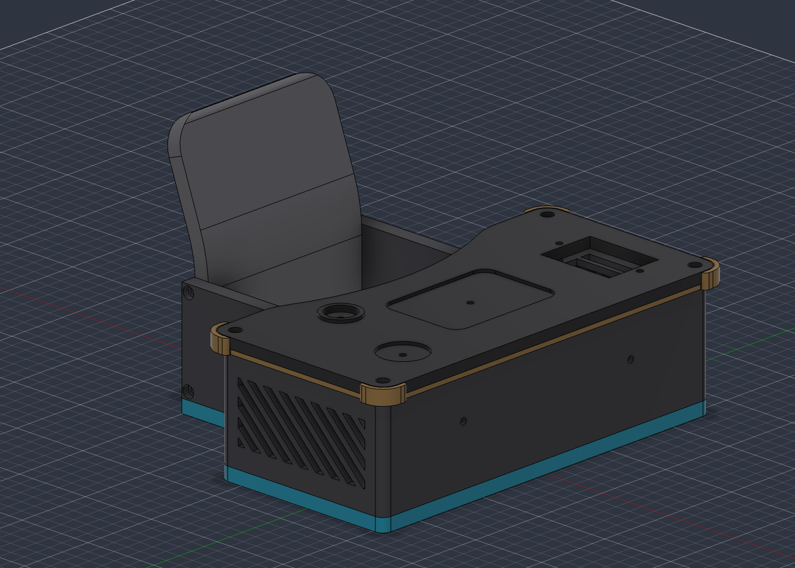
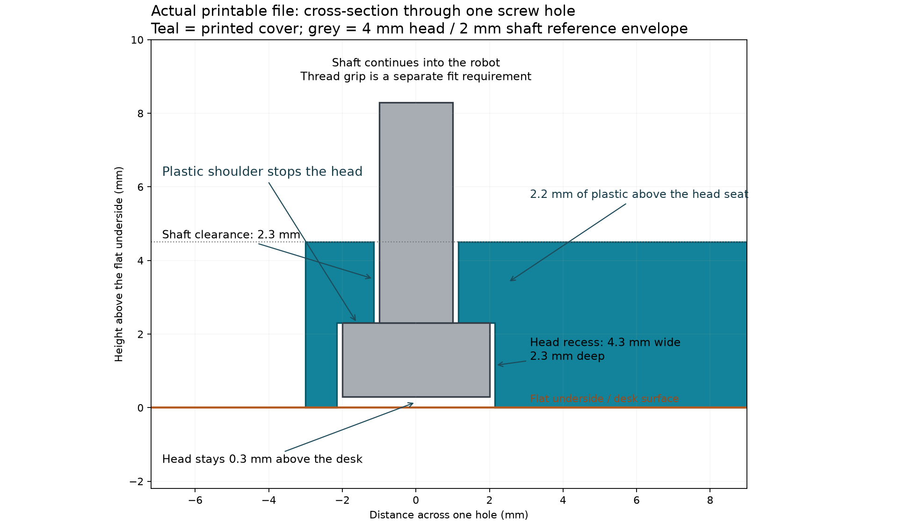

# Optional HD1370A bottom cover

A removable T-shaped cover for the underside of the HD1370A desk and chair, with four recessed M2 head seats and a flat exterior face. **Prototype: perimeter and head-seat geometry checked in CAD; physical fit and screw retention are not yet verified.** This fixed outline does not fit SG90 or FS0307.

## Files

- [Printable 3MF](../3mf/BottomCover.3mf) and [STL](../stl/BottomCover.stl): one part, millimeters, 100% scale, recesses facing up. No printer or filament profile is embedded.
- [Editable Fusion cover](../../../cad/bottom-cover/BottomCover_HD1370A.f3d): fixed source-derived perimeter; editable thickness and screw/head clearances.
- [STEP](../step/BottomCover.step): installed orientation, floor at Z=0 and mating face at Z=4.5 mm.
- [Aligned Fusion inspection assembly](../../../cad/bottom-cover/BottomCover_FitCheck_HD1370A.f3d): original desk, chair, desktop, pad and four reference screw envelopes. **Do not print this assembly or its screw envelopes.**
- [Master Fusion assembly](../../../cad/TinyEngineer.f3d): includes `OPTIONAL_BOTTOM_COVER_HD1370A`, hidden by default and outside `PRINT_LAYOUT`. Apply the HD1370A servo preset before showing it. It is a fixed reference body; edit the independent cover and run the integration script to replace it. The normal exporter therefore cannot include this HD1370A-only part in another servo family's export.

## Dimensions

| Feature | mm |
| --- | --- |
| Overall width × front-to-back depth × thickness | 129.2 × 104.3 × 4.5 |
| Four shaft clearance holes | Ø2.3 |
| Four underside head recesses | Ø4.3 × 2.3 deep |
| Plastic above each head seat | 2.2 |
| Hole-center spacing | 123.2 × 56 |
| Outer border offset | 0 |

The outline copies 21 line/arc segments from the actual desk underside: R3 desk corners and shoulder transitions, R1 notch ends, and square rear corners. A straight rear edge coincides with the desk/chair rear plane and spans the two existing 0.3 mm assembly seams. [All-corner comparison](perimeter-corner-check.png).

## Fastening limitation

The modeled screw envelope is M2×6 with a 4 mm-diameter, 2 mm-high head. The head rests against a shoulder and stays 0.3 mm above the floor. The shaft passes through 2.2 mm of plastic and extends 3.8 mm into the desk channel. That is insertion length, **not verified thread engagement**. Actual pan/button heads must fit the modeled envelope.

The existing desk channels are smooth Ø2.1 mm in CAD. An M2 machine screw without a nut must grip the actual printed hole for this attachment to work. If the screw slides or spins freely, this cover does not provide a secure fastening solution. No nut pockets, inserts or modeled threads are included. Follow the repository's [screw sizing test](../../../README.md#print-first) before relying on the attachment. Do not enlarge the desk channels to the cover's clearance diameter.

## Printing and fitting

Print the supplied 3MF/STL with the large recesses facing up and the mating face on the bed. This avoids bridging the head pockets. PLA or PETG, 0.2 mm layers and at least four walls are starting settings; use a calibrated material profile. The footprint fits a 180 × 180 mm bed. No supports are required by the geometry.

Dry-fit before adding screws. Remove first-layer flare if it prevents flush seating. Check the wire bundle stays above the mating plane and the existing USB opening remains accessible. Tighten only until seated, and verify that neither a screw head nor a warped corner touches the desk first. Retain removable access to electronics.

## Verification

- Independent Fusion STEP and CadQuery solids: zero symmetric-difference volume.
- Source underside versus cover perimeter: zero excess/missing area; sampled edge deviation below 0.000001 mm.
- Four hole centers align with the existing desk channels; no solid intersections with desk, chair, desktop or pad.
- Four head seats stop the reference screw heads; pushing each head 0.1 mm into its shoulder produces an intersection. The bearing overlap is 0.85 mm radially.
- Native Fusion archive reopens with one solid, three healthy modeling features and six timeline entries.
- Printable 3MF: one watertight mesh, four through-holes, correct dimensions and upward-facing recesses.
- Updated master: original user parameters and original geometry checked, optional reference hidden, and HD1370A interference checked separately.

These checks do not establish screw grip, printing tolerances, wiring clearance, thermal behavior or full robot motion. **No completed physical print or assembled fit is claimed.**

Evidence: [geometry](verification.json), [perimeter](perimeter-verification.json), [Fusion](fusion-verification.json), [assembly](fusion-final-checks.json), [print mesh](print-verification.json), [head seats](screw-seat-check.json), [master integration](master-integration-verification.json).

## Source and license

[Rebuild instructions and scripts](../../../cad/bottom-cover/README.md). Derived from Tiny Engineer by Krzysztof Jamroz; cover addition by Hanson Wen, 2026. CAD and exports are CERN-OHL-S-2.0; see [LICENSE](../../../LICENSE) and [NOTICE](../../../NOTICE). The modified source location is recorded in NOTICE; use the corresponding revision when distributing this modification.
