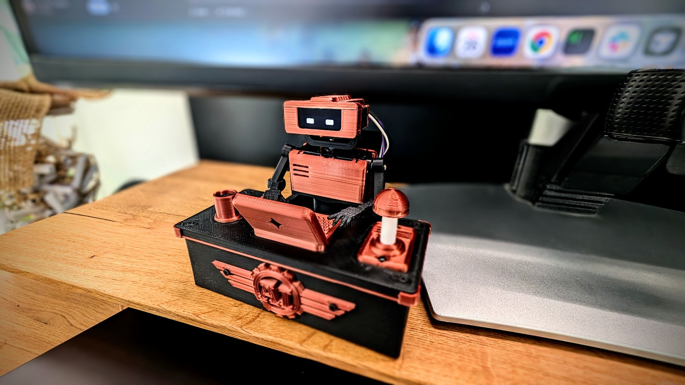

# Tiny Engineer

Imagine your AI coding agent had a tiny body and worked at the desk next to you.

Tiny Software Engineer is a physical avatar for an AI coding agent. It reads, thinks, types, and reacts as the agent works — turning invisible software activity into the behavior of a tiny teammate sitting beside you.

Instead of watching a progress spinner, just glance at your desk and see your AI at work.

---

Tiny Engineer is a small Wi-Fi desk robot that acts out your AI coding assistant while it works.

When you ask Cursor, Claude Code, or another agent to do a task, the model is busy somewhere in the cloud. On your desk, Tiny Engineer pretends it is the one doing the job: typing on a keyboard, leaning in to read, pausing to think, then getting back to work.

[Watch the project video](https://www.youtube.com/watch?v=gVmg_FFCgAY)

## Docs

| Goal | Doc |
| --- | --- |
| Build end-to-end (parts, print, wire, flash, first anim) | [docs/getting-started.md](docs/getting-started.md) |
| Cursor hooks | [docs/hooks.md](docs/hooks.md) |
| Any IDE / REST | [docs/integration.md](docs/integration.md) |
| HTTP API | [docs/api.md](docs/api.md) |
| Wiring / power reference | [docs/hardware/README.md](docs/hardware/README.md) |
| Printable parts | [3d_models/README.md](3d_models/README.md) |
| Full index | [docs/README.md](docs/README.md) |

## License

MIT. See [LICENSE](LICENSE).
