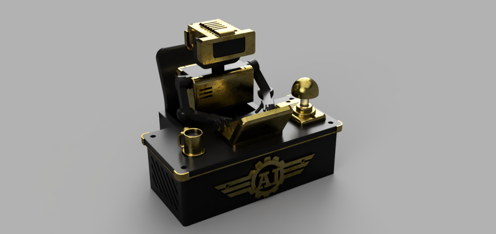

# Tiny Engineer

Tiny Engineer is a small Wi-Fi desk robot that acts out your AI coding assistant while it works.

When you ask Cursor, Claude Code, or another agent to do a task, the model is busy somewhere in the cloud. On your desk, Tiny Engineer pretends it is the one doing the job: typing on a keyboard, leaning in to read, pausing to think, then getting back to work.



## The idea

AI tools already feel a bit like a coworker in another room. Tiny Engineer puts a tiny coworker on the desk.

You keep using the tools you already use. The robot does not write the code. It performs the *waiting*: the stretch of time between “please fix this” and “here is the patch.” Head turns toward a miniature laptop. Arms tap the keys. The pose shifts when the model is “thinking.” It is theatre, on purpose.

The point is not to fake intelligence. The point is to make the invisible stretch of inference visible, and a little bit funny.

Later firmware will take live status over Wi-Fi (agent running, waiting, done) and map it to those gestures. Right now the repo is the hardware plus a small JSON HTTP server: ESP32-C3, five servos, OLED, speaker, so the body can move, show a line of text, and make a sound.

## Hardware

Controller is a **Waveshare ESP32-C3-Zero**. Servos, display, and audio wiring live in [`docs/hardware/`](docs/hardware/README.md). Robot layout and servo axes: [`docs/robot-movement.md`](docs/robot-movement.md).

## Build and flash

Arduino firmware, built with [PlatformIO](https://platformio.org/). Boot inits onboard RGB, SSD1306 OLED, Wi-Fi, PCA9685 (5 servos), and MAX98357A (I2S), then serves JSON on port 80.

Copy `include/secrets.h.example` to `include/secrets.h` and set `WIFI_SSID` / `WIFI_PASSWORD`. That file is gitignored.

Prerequisites:

- [PlatformIO Core (CLI)](https://docs.platformio.org/en/latest/core/installation.html), or the PlatformIO extension in VS Code / Cursor
- ESP32-C3-Zero connected over USB

From the project root:

```bash
pio run                 # build
pio run -t upload       # flash the board
pio device monitor      # serial monitor (115200 baud)
```

Build and flash in one step:

```bash
pio run -t upload && pio device monitor
```

If several serial ports are present, pick one:

```bash
pio device list
pio run -t upload --upload-port /dev/cu.usbserial-XXXX
pio device monitor --port /dev/cu.usbserial-XXXX
```

Board and baud rate live in `platformio.ini`. The platform package is [pioarduino](https://github.com/pioarduino/platform-espressif32) (Arduino-ESP32 3.x) so `ESP_I2S` and `rgbLedWrite` are available.

## HTTP API

After Wi-Fi connects, the board listens on port 80 (`http://tiny-engineer.local/` or the IP on the OLED). Open `/` in a browser for the endpoint index.

```bash
curl http://tiny-engineer.local/health
curl -X POST http://tiny-engineer.local/test/audio
curl -X POST http://tiny-engineer.local/test/screen
curl -X POST http://tiny-engineer.local/test/movement
curl -X POST http://tiny-engineer.local/test/led
curl -X POST "http://tiny-engineer.local/test/servo?index=0&angle=90"
```

`GET /` is an HTML endpoint index. `GET /health` is health JSON. Test routes are **POST** (they move hardware). Full reference: [`docs/api.md`](docs/api.md).

## Cursor hooks

Open this repo in Cursor with the robot on Wi-Fi. Project hooks under `.cursor/` POST to `/anim` so the desk robot types, reads, thinks, then idles with the agent. The onboard RGB LED mirrors the animation (white while working, red for attention/error, off when idle). Setup and event map: [`docs/hooks.md`](docs/hooks.md).

## License

MIT. See [LICENSE](LICENSE).
