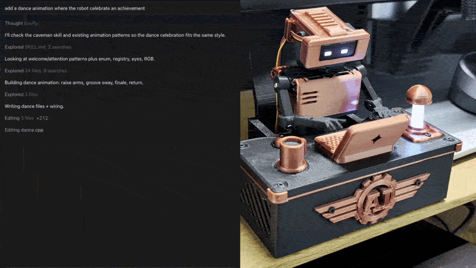
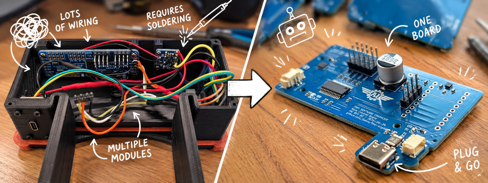
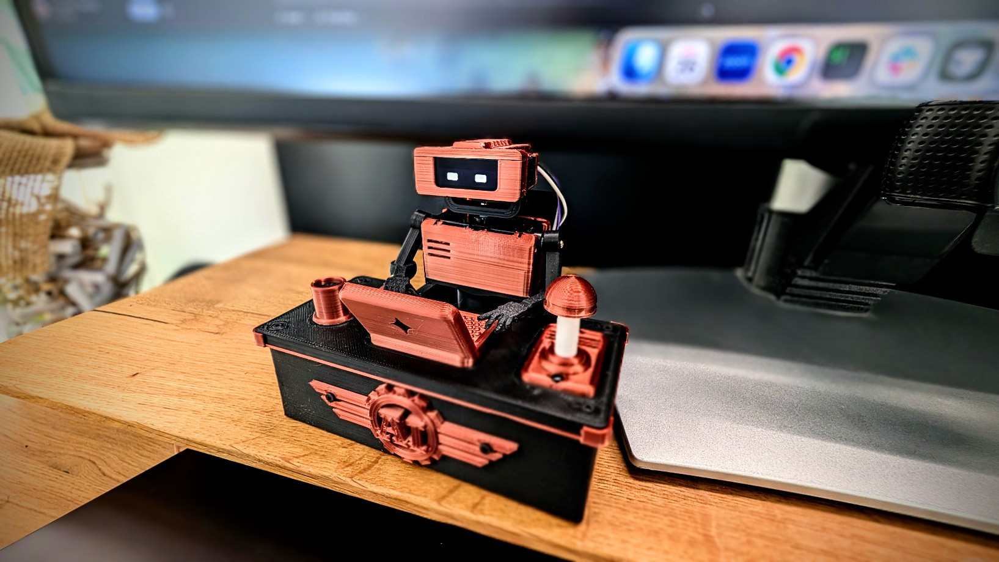
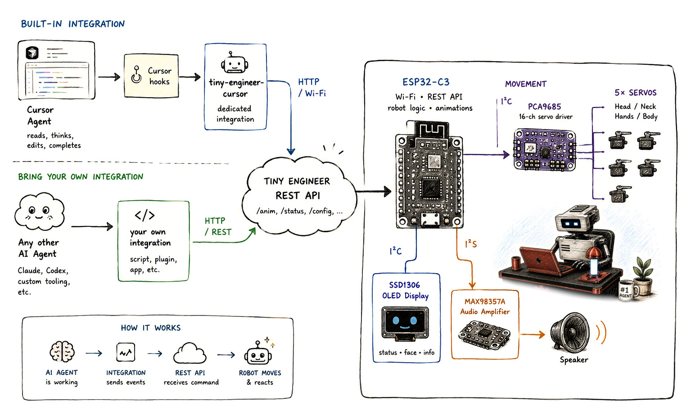

# Tiny Engineer

> Give your AI coding agent a body.

**[Watch the demo](https://youtu.be/RX_QRxdXMjg)** · [Build your own](#build-your-own) · [Community builds](#community-builds) · [How it works](#how-it-works)

A small robot on your desk. It moves, changes its face, and rings a bell as your coding AI agent works.

| Your agent… | The robot… |
| --- | --- |
| Reads files | Looks around |
| Writes code | Types |
| Thinks or waits | Looks up |
| Finishes the task | Rings the bell |

Open source. Print the body, plug the ESP32, servos, OLED, and speaker into the [main control board](docs/hardware/main-control-board.md), flash it, and it joins your Wi-Fi.

**Works with** [Claude Code](docs/integration.md#4-claude-code-dedicated-script) · [Cursor](docs/hooks.md) · [Antigravity](docs/integration.md#3-antigravity-cli-dedicated-script) — or Codex, Windsurf, and any script that can POST ([integration guide](docs/integration.md)), including speech through [`POST /play`](docs/api.md#post-play).

## Build your own

| | |
| --- | --- |
| **Parts (electronics + 5× SG90 Servos)** | [shopping list](docs/shopping.md): [main control board](docs/hardware/order-main-control-board.md) plus ESP32, servos, OLED, and speaker |
| **Also needed** | 3D printer + filament, or [order prints](docs/3d/order-parts.md); M2 screws; **5 V / ≥2 A** USB supply |
| **Tools** | Plug in the ESP32, servos, OLED, and speaker on the [main control board](docs/hardware/main-control-board.md). Want to add extra modules? [advanced wiring](docs/hardware/wiring.md) |
| **Difficulty** | **Medium** - fair first hardware project for a software engineer, not a one-LED kit. Optional primer: [From Code to Circuits](docs/hardware-for-software-engineers/README.md) |

The default build uses the open-source main control board. Order it from any fab ([how to order](docs/hardware/order-main-control-board.md) · [KiCad](hardware/boards/main-control-board/)). 

If a ~$15–20 assembled board like this would be useful to you, [Vote here 👍 →](https://github.com/jamro/tiny-engineer/discussions/50) → I’m using the interest to decide whether it’s worth developing further.

**Print → Connect → Flash → Assemble** - step-by-step: **[Getting started](docs/getting-started.md)**.

## Community builds

Finished builds, mods, and desk setups live in **[Show and tell](https://github.com/jamro/tiny-engineer/discussions/categories/show-and-tell)** on GitHub Discussions - browse what others made and post photos of yours.

**Built one? [Share in Show and tell →](https://github.com/jamro/tiny-engineer/discussions/categories/show-and-tell)**

## Roadmap

What we are building toward:

- **More agent integrations** - one-command hooks for more IDEs and CLIs
- **Simplified build process** - easier assembly and setup for quicker builds
- **New characters / bodies** - alternate shells and mods
- **Multi-agent desk** - more than one tiny teammate

**[Star Tiny Engineer](https://github.com/jamro/tiny-engineer)** to follow the build.

## How it works

Your agent (or a hook script) sends poses over HTTP. The **ESP32-C3** is a small Wi-Fi computer on the robot — one chip that runs the program, joins your network, hosts REST API, and drives the servos, the face, and the speaker.

**Clients**

- **Cursor** - hooks → `tiny-engineer-cursor` → Wi-Fi
- **Antigravity** - lifecycle hooks → `tiny-engineer-antigravity` → Wi-Fi
- **Claude Code** - project hooks → `tiny-engineer-claude-code` → Wi-Fi
- **Bring your own** - any tool that can `POST` to `/anim`

Details: [Integrations](docs/integration.md) · [HTTP API](docs/api.md) · [Cursor hooks](docs/hooks.md)

## Documentation

| You want to… | Start here |
| --- | --- |
| Build the robot | [Getting started](docs/getting-started.md) |
| Buy parts | [Shopping list](docs/shopping.md) |
| Flash the board | **[Web flash](https://jamro.github.io/tiny-engineer/flash/)** · [Flash](docs/flash.md) |
| Assemble the prints | [Assembly](docs/3d/assembly.md) |
| Print the parts | [3D models](3d_models/README.md) |
| Hook up an agent | [Integrations](docs/integration.md) |
| Call the HTTP API | [API](docs/api.md) |
| Anything else | [Docs index](docs/README.md) |

Print it, connect it, change the CAD, or hook up another agent. Issues and PRs welcome - especially new integrations. [CONTRIBUTING.md](CONTRIBUTING.md) · [SECURITY.md](SECURITY.md) · [CODE_OF_CONDUCT.md](CODE_OF_CONDUCT.md)

## License

- **Software** (firmware, integrations, scripts, documentation) — [MIT](LICENSE)
- **Hardware designs** (CAD source and printables in [`3d_models/`](3d_models/) and under [`mods/*/3d_models/`](mods/); KiCad PCBs in [`hardware/`](hardware/)) — [CERN-OHL-S-2.0](3d_models/LICENSE)

See [LICENSING.md](LICENSING.md) for scope and effective date. The **Tiny Engineer** name and logo are not licensed - see [TRADEMARK.md](TRADEMARK.md).
