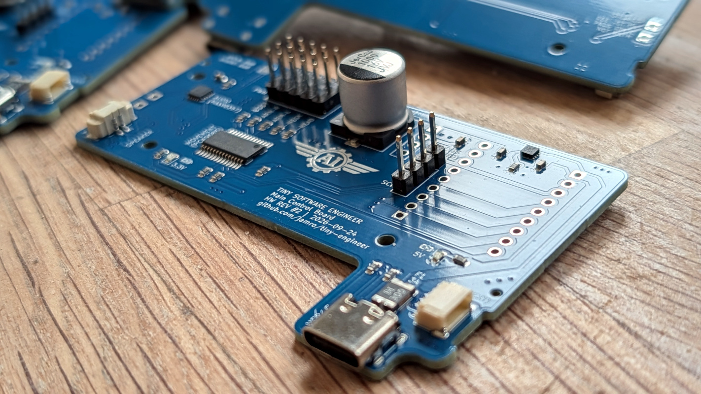

# Tiny Engineer

> Give your AI coding agent a body.

**[Watch the demo](https://youtu.be/RX_QRxdXMjg)** · [Build your own](#build-your-own) · [Community builds](#community-builds) · [How it works](#how-it-works)

- Looks around while the agent **reads**
- **Types** while it writes code
- Looks **up** while it thinks
- **Rings the bell** when the task is done

**Works with**

- **Ready integrations:** [Claude Code](docs/integration.md#4-claude-code-dedicated-script) · [Cursor](docs/hooks.md) · [Antigravity](docs/integration.md#3-antigravity-cli-dedicated-script)
- **Any agent with HTTP:** Codex, Windsurf, custom scripts, `POST /anim` on your LAN ([integration guide](docs/integration.md))

## What it feels like

| Your agent… | Tiny Engineer… |
| --- | --- |
| Reads files | Looks around |
| Edits code | Types |
| Thinks / waits | Looks up |
| Finishes a task | Rings the bell |

Open-source desk robot: 3D-printable body, Wi-Fi, and a small REST API so your tools can drive the poses.

## See it move

**[YouTube demo](https://youtu.be/RX_QRxdXMjg)**

## Build your own

| | |
| --- | --- |
| **Parts (electronics + 5× SG90 Servos)** | About **$50–70** [shopping list](docs/shopping.md) — modular breakouts **or** [main control board](docs/shopping.md#choose-electronics-path) |
| **Also budget for** | 3D printer + filament, or [order prints](docs/3d/order-parts.md); M2 screws; **5 V / ≥2 A** USB supply |
| **Tools** | Modular path: soldering for the harness. Main control board: mostly plug-in (fab the PCB first) |
| **Difficulty** | **Medium** - fair first hardware project for a software engineer, not a one-LED kit. Optional primer: [From Code to Circuits](docs/hardware-for-software-engineers/README.md) |

**Print → Wire → Flash → Assemble → Connect** - step-by-step: **[Getting started](docs/getting-started.md)**.

## Skip the breakout jungle

**Rev 2 is real — and open source.** One board replaces the PCA9685 servo driver, MAX98357A amp, and USB-C breakout. Plug in the ESP32-C3-Zero, five servos, OLED, and speaker. Equal alternative to the modular harness — pick a path in [shopping](docs/shopping.md#choose-electronics-path); connect steps: [main-control-board.md](docs/hardware/main-control-board.md).

KiCad sources live in the repo ([CERN-OHL-S](3d_models/LICENSE)). Download the design and order manufacturing from any fab yourself today.

The **[interest check](https://github.com/jamro/tiny-engineer/discussions/50)** is about going further: a community batch so boards are cheaper at volume and easy to buy — no fab account, no gerber upload. Say if you’d want a bare PCB, assembled board, or kit.

Board details: [hardware/boards/main-control-board](hardware/boards/main-control-board/).

## Community builds

Finished builds, mods, and desk setups live in **[Show and tell](https://github.com/jamro/tiny-engineer/discussions/categories/show-and-tell)** on GitHub Discussions - browse what others made and post photos of yours.

**Built one? [Share in Show and tell →](https://github.com/jamro/tiny-engineer/discussions/categories/show-and-tell)**

## Roadmap

What we are building toward:

- **Integrated PCB** - less wiring, faster builds
- **More agent integrations** - one-command hooks for more IDEs and CLIs
- **Simplified build process** - easier assembly and setup for quicker builds
- **New characters / bodies** - alternate shells and mods
- **Multi-agent desk** - more than one tiny teammate

**[Star Tiny Engineer](https://github.com/jamro/tiny-engineer)** to follow the build.

## How it works

Your agent (or a hook script) sends poses over HTTP. The ESP32-C3 on the robot runs the REST API, animations, and audio, then drives five servos, an OLED face, and a speaker.

**Clients**

- **Cursor** - hooks → `tiny-engineer-cursor` → Wi-Fi
- **Antigravity** - lifecycle hooks → `tiny-engineer-antigravity` → Wi-Fi
- **Claude Code** - project hooks → `tiny-engineer-claude-code` → Wi-Fi
- **Bring your own** - any tool that can `POST` to `/anim`

Details: [Integrations](docs/integration.md) · [HTTP API](docs/api.md) · [Cursor hooks](docs/hooks.md)

## Documentation

| Goal | Doc |
| --- | --- |
| Build end-to-end | [docs/getting-started.md](docs/getting-started.md) |
| Flash firmware | **[Web flash](https://jamro.github.io/tiny-engineer/flash/)** · [docs/flash.md](docs/flash.md) (PlatformIO / mods / OTA) |
| Parts / cart | [docs/shopping.md](docs/shopping.md) (modular or main control board) |
| Wiring / power | [docs/hardware/README.md](docs/hardware/README.md) · PCB path: [docs/hardware/main-control-board.md](docs/hardware/main-control-board.md) |
| Printable parts | [3d_models/README.md](3d_models/README.md) |
| Optional mods | [mods/README.md](mods/README.md) |
| Assemble printed parts | [docs/3d/assembly.md](docs/3d/assembly.md) |
| Resize CAD for another servo | [docs/3d/parametric-design.md](docs/3d/parametric-design.md) |
| Servo axes / safe ranges | [docs/robot-movement.md](docs/robot-movement.md) |
| HTTP API | [docs/api.md](docs/api.md) |
| Settings | [docs/settings.md](docs/settings.md) |
| Cursor hooks | [docs/hooks.md](docs/hooks.md) |
| Any IDE / REST | [docs/integration.md](docs/integration.md) |
| Firmware / package tests | [docs/testing.md](docs/testing.md) |
| Full index | [docs/README.md](docs/README.md) |

Print it, wire it, change the CAD, or hook up another agent. Issues and PRs welcome - especially new integrations. [CONTRIBUTING.md](CONTRIBUTING.md) · [SECURITY.md](SECURITY.md) · [CODE_OF_CONDUCT.md](CODE_OF_CONDUCT.md)

## License

- **Software** (firmware, integrations, scripts, documentation) — [MIT](LICENSE)
- **Hardware designs** (CAD source and printables in [`3d_models/`](3d_models/) and under [`mods/*/3d_models/`](mods/); KiCad PCBs in [`hardware/`](hardware/)) — [CERN-OHL-S-2.0](3d_models/LICENSE)

See [LICENSING.md](LICENSING.md) for scope and effective date. The **Tiny Engineer** name and logo are not licensed - see [TRADEMARK.md](TRADEMARK.md).
