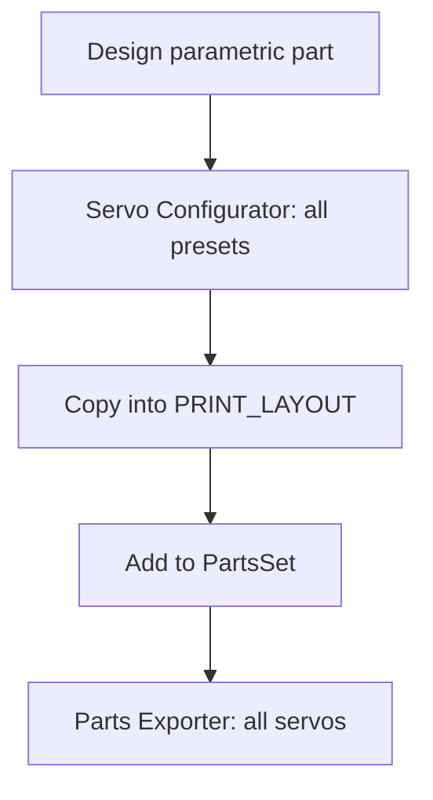

# Adding parts to the CAD

Contributor workflow for new printable geometry in [`3d_models/cad/TinyEngineer.f3d`](../../3d_models/cad/TinyEngineer.f3d). For servo presets and add-in install, see [parametric design](parametric-design.md). For builders printing existing parts, see [`3d_models/README.md`](../../3d_models/README.md).



## Design rules

### Source of truth

Edit [`cad/TinyEngineer.f3d`](../../3d_models/cad/TinyEngineer.f3d) only. Never hand-edit `.3mf`, `.stl`, or `.step` exports — those are the release binaries. Change the Fusion source, then re-export.

### Parametric, multi-servo

Drive dimensions from Fusion **user parameters** (servo presets in [`servos.json`](../../3d_models/fusion/TinyEngineerTools/servos.json), or other shared params). Prefer referencing existing geometry (edges, faces, projected sketches) over hard-coded lengths that only fit one servo.

The design must rebuild cleanly for **every** predefined servo. Do not ship a part that only works for SG90.

Do not invent new keys in `servos.json`. Parameter names must already exist as Fusion user parameters in the `.f3d`. Details: [Add a new servo](parametric-design.md#add-a-new-servo).

### Naming

Keep one name end to end:

- Fusion component name
- Direct child under `PRINT_LAYOUT` (what the exporter lists)
- Export basename (`Head.3mf`, …)
- Row in the [`3d_models/README.md`](../../3d_models/README.md) parts table

### Print without supports

Orient and feature the part so FDM can print it **without supports** (no large overhangs past what your bridging/chamfers already handle). The print-ready copy under `PRINT_LAYOUT` must sit on a flat face on the horizontal origin.

### `min_wall_thickness`

Use the Fusion user parameter **`min_wall_thickness`** as the floor for:

- Walls
- Thin horizontal layers / floors

That keeps parts printable at third-party services and on typical 0.4 mm-nozzle FDM setups. Do not go thinner than this parameter.

### M2 / fasteners

Assembly uses **M2** screws that thread directly into printed PLA/PETG. New screw pilots use `screw_thread_diameter` (related: `screw_head_diameter`, `screw_head_height`). Details: [M2 screw holes](parametric-design.md#m2-screw-holes).

- No heat-set inserts unless an intentional, documented exception.
- Prefer existing lengths **M2×4 / M2×8 / M2×16**.
- If a new length is required, update the screw BOM in [`3d_models/README.md`](../../3d_models/README.md) and the cart in [`docs/shopping.md`](../shopping.md).

### Clearance / fit

Design so parts and hardware fit **without sanding** as the happy path. Leave real clearance for servo bodies, horns, and moving links so joints do not bind.

## Timeline discipline

Keep the Fusion timeline readable for other contributors.

1. **One component, one block** — Create the part as a **separate component**. Keep all features that belong to that component (sketches, extrudes, fillets, holes, …) **next to** its creation on the timeline. Do not scatter edits to the same component across distant timeline positions.
2. **Components first, joints later** — Create (or finish) components first. Add joints that lock assembly positions in a **later** timeline section, after component creation.
3. **Same rule under `PRINT_LAYOUT`** — Inside `PRINT_LAYOUT`, define/copy components first; add assembly joints afterward.

## Assembly vs print layout

### Functional assembly

Joint the new component into the main robot assembly so it sits correctly relative to neighbors for all servo presets.

### Print-ready copy (`PRINT_LAYOUT`)

1. **Copy & paste** (not **Paste New**) a ready-to-print instance under the **`PRINT_LAYOUT`** component. Paste keeps the link to the source component so parametric updates stay in sync.
2. Orient it so it lies on the **horizontal origin**, print face down, **no supports**.
3. Lock it to the origin with a **joint** so the export pose stays fixed.
4. Add it to the correct **`PRINT_LAYOUT` / `PartsSet*`** aggregate for its **intended print color** only — do not mix colors in one set. Nest/place it to keep the print bed footprint realistically compact. Lock that placement with a **joint** as well.

`PartsSetA` / `PartsSetB` (and similar) are aggregates of same-color parts for [service orders](order-parts.md). Home printers usually print individual `.3mf` files instead — see [`3d_models/README.md`](../../3d_models/README.md).

## Validate every servo preset

Before you call the part done:

1. Open **Utilities → Add-Ins → TinyEngineer Servo Configurator**.
2. Switch through **all** predefined servos.
3. Confirm the **new part** and the **whole design** update without compute **errors** or **warnings** for any preset.

Fix failures for every preset, not only the one you design against.

## Export

Use **Utilities → Add-Ins → Tiny Engineer Parts Exporter** to export the new part(s) from `PRINT_LAYOUT` into the supported formats for **all** supported servos. Output lands under `3d_models/parts/{servo_id}/` (`3mf/`, `stl/`, `step/`). Details: [parametric design — Parts Exporter](parametric-design.md#tiny-engineer-parts-exporter).

Commit both the updated `.f3d` and the exported meshes/STEP for the affected servos.

## Docs, trademark, and license

After the CAD and exports land:

- **Docs sync** — new stock part → parts table in [`3d_models/README.md`](../../3d_models/README.md); color-group / aggregate change → [order-parts.md](order-parts.md); join-order change → [assembly.md](assembly.md).
- **Trademark** — do not replace or repurpose `AiEmblem` as branding. See [TRADEMARK.md](../../TRADEMARK.md).
- **License** — `cad/` and `parts/` (including under mods) are [CERN-OHL-S-2.0](../../3d_models/LICENSE). When distributing Products based on these designs, keep Source Location accurate per [`3d_models/NOTICE`](../../3d_models/NOTICE).

## Optional mods

Optional elements and community mods do **not** go in the main `cad/` / `parts/` trees as first-class stock parts unless they become core. Overview: [`3d_models/mods/README.md`](../../3d_models/mods/README.md).

Place them under:

```text
3d_models/mods/<mod_name>/
  cad/      # Fusion source for the mod
  parts/   # Exported meshes, same layout idea as 3d_models/parts/
  README.md  # optional but recommended: fit notes, which servo folders exported
```

Mirror the top-level `3d_models` structure (`cad` + `parts`). Keep CERN-OHL-S licensing consistent with [`3d_models/LICENSE`](../../3d_models/LICENSE) when you distribute Products based on these designs. Each mod may include a short `README.md` describing what it fits and which `parts/{servo_id}/` folders were exported.

## Checklist

- [ ] Source of truth: `.f3d` edited; exports re-generated (no hand-edited meshes)
- [ ] Naming: component = `PRINT_LAYOUT` child = export basename = README parts table
- [ ] Parametric (user params / referenced geometry); works for all presets
- [ ] No invented `servos.json` keys (Fusion user params first)
- [ ] Printable without supports; walls/floors ≥ `min_wall_thickness`
- [ ] M2 pilots use `screw_thread_diameter`; BOM/shopping updated if a new length is needed
- [ ] Clearance for servos, horns, and moving links (fit without sanding)
- [ ] Separate component; features grouped on the timeline
- [ ] Timeline: components → joints (including under `PRINT_LAYOUT`)
- [ ] Servo Configurator: no errors/warnings for any predefined servo
- [ ] Copy (not Paste New) under `PRINT_LAYOUT`, origin joint, print orientation
- [ ] Placed in the correct same-color `PartsSet*` with a joint; bed footprint kept reasonable
- [ ] Parts Exporter export for all servos; `.f3d` + exports committed
- [ ] Docs synced (README parts table / order-parts / assembly as needed)
- [ ] `AiEmblem` not repurposed as branding
- [ ] CERN-OHL-S respected; NOTICE Source Location accurate if distributing Products
- [ ] Optional/mod work under `3d_models/mods/<mod_name>/{cad,parts}/` (+ mod README)

## Related

| Topic | Doc |
| --- | --- |
| Servo params, add-in install, new servo preset | [parametric-design.md](parametric-design.md) |
| Print / part inventory | [`3d_models/README.md`](../../3d_models/README.md) |
| Optional mods folder | [`3d_models/mods/README.md`](../../3d_models/mods/README.md) |
| Order aggregated sets | [order-parts.md](order-parts.md) |
| Mechanical assembly | [assembly.md](assembly.md) |
| Trademark | [TRADEMARK.md](../../TRADEMARK.md) |
| Contribute / licenses | [CONTRIBUTING.md](../../CONTRIBUTING.md) |
