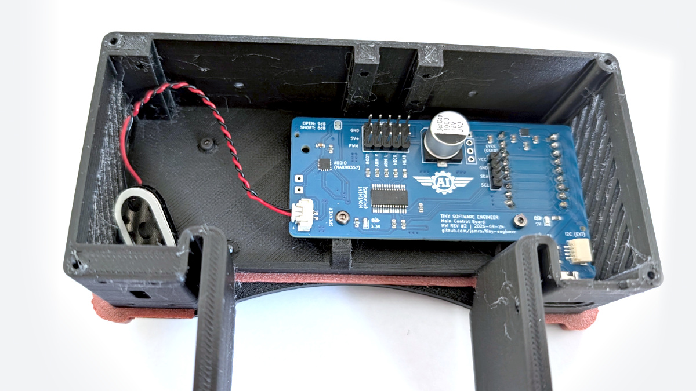
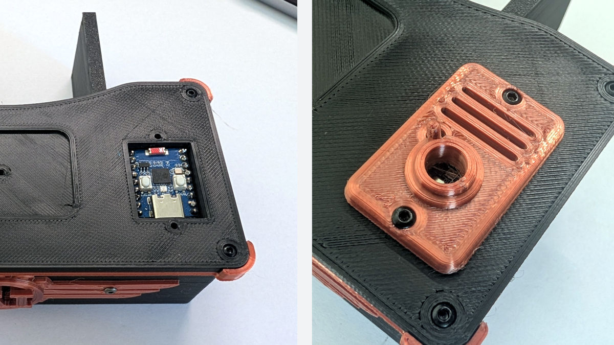

# Modular assembly (advanced)

Mount breakout modules in the printed `Desk`. Use this when you add hardware the main control board does not support.

The default build seats the [main control board](../hardware/main-control-board.md) — follow [assembly.md](assembly.md) §12 and §13. This page replaces those two steps only. Electrical harness: [wiring.md](../hardware/wiring.md).

By this point the breakouts should already be wired and soldered as one harness, and firmware flashed ([flash.md](../flash.md)). Then return to [assembly §14](assembly.md#14-desk-props--laptop-mug-bell). Servo channel order is the same table in [assembly §15](assembly.md#15-connect-servos-and-oled); plug the leads into the PCA9685 instead of the board headers.

## Electronics inside the desk

**Leave disconnected for now:**

- ESP32 — attach the gold-pin jumper cables to the ESP32 pins in the next section
- PCA9685 — plug servo connectors in [assembly §15](assembly.md#15-connect-servos-and-oled)

Everything else in the harness stays as already soldered and assembled.

1. **USB-C breakout (Adafruit 5993)** — fasten with four longer M2 screws (M2×16 mm works) and secure with M2 nuts.
2. **PCA9685** — fasten to the rails on the inside of the desk front with four short M2 screws (M2×4 mm works).
3. **MAX98357A** — mount on the single rail on that same inner front wall with two M2 screws (M2×4 mm works).
4. **Speaker** — stick it to an inner wall, or leave it loose inside the desk for now.

Mount in that order — USB first, then PCA9685, then MAX98357A, then the speaker — so later boards are not in the way.

## ESP32, power/AP smoke test, and `LampBase`

1. Seat the **ESP32-C3-Zero** in the opening in the desk top from above. The pins must pass through the holes in the top; the module should sit flush in the recess and not stick up above the desk surface.
2. From underneath, connect the gold-pin jumper cables to the ESP32.
3. **Power/AP smoke test** (optional but recommended) before locking the module in:
   - Confirm every wire is on the correct pin ([wiring](../hardware/wiring.md)). Servo plugs and the OLED come later.
   - Firmware should already be on the board (flashed before servo centering).
   - Apply power. The ESP32 LED should light and the board should start the **setup access point** for configuration.
   - If that looks good, **disconnect power**.
4. Place the printed `LampButton` under `LampBase` so it can press the ESP32 **reset** button from above — keep that access easy.
5. Orient `LampBase` so its opening sits over the ESP32 status LED.
6. Fasten `LampBase` to the desk with **two M2 screws** (M2×8 mm works). This also holds the ESP32 from above.

## Next

Continue at [assembly §14](assembly.md#14-desk-props--laptop-mug-bell).
