# Mechanical assembly

How to join the printed parts and seat the five micro servos. Use **M2 screws** that thread into the plastic — no glue, no heat-set inserts.

Screw lengths called out below (M2×4 / ×8 / ×16) match the reference shopping list. If you substitute nearby lengths, **test-fit** first. Totals: [3d_models/README.md → Screws](../../3d_models/README.md#screws).

**Before you start:** print or order the set for your servo model ([3d_models/README.md](../../3d_models/README.md), [order-parts.md](order-parts.md)). All five servos are the same type; the printed pockets match that model.

**Left / right:** throughout this guide, “robot’s left” and “robot’s right” mean the **figure’s** sides — not your left/right as you face it.

### Build map

1. Head + Hat (OLED + head servo)
2. **Wire, flash, setup AP** (required before any centering)
3. Center Neck → join Head/Neck → Chest side servos → mount on Chest → Belly → Chair
4. Desk stack → mount electronics → plug channels → Chair↔Desk
5. Arms → Lamp → setup wizard

## 1. Head — OLED and servo

1. Peel the protective sticker off the Waveshare OLED screen.
2. Plug the cable that shipped with the Waveshare OLED into the display **before** seating it. Once the OLED is in its pocket, the connector is hard to reach.
3. Take one of the five identical micro servos. Do **not** attach a horn yet. Orientation does not matter at this stage.
4. Seat the servo and the OLED into their dedicated pockets in the printed `Head`.
5. Route both cables through the openings in the shell — OLED cable on one side of the head, servo lead on the opposite side.
6. Clip each cable into the molded cable clips on the **back** of `Head` (clips are part of the print).

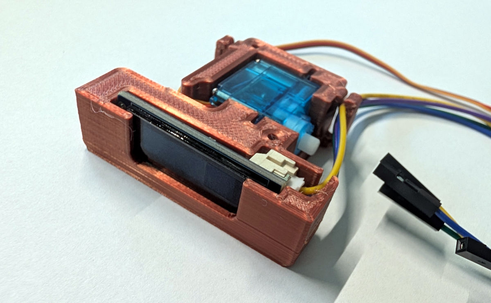

## 2. Hat

1. Place `Hat` on top of `Head`.
2. Fasten with **two M2 screws** (M2×8 mm works). Thread into the printed plastic — do not overtighten.

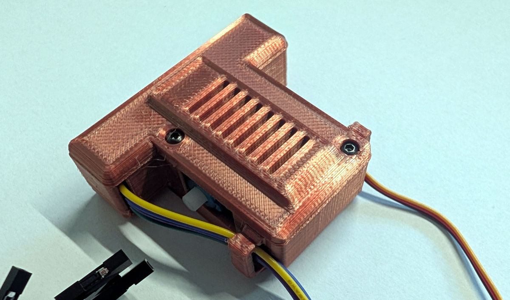

## 2a. Electronics and firmware (required before centering)

From here on you set each printed part on a servo that is already at **90°** (shaft center). That needs a working board.

1. Build and wire the electronics ([wiring](../hardware/wiring.md), [getting started → Wire](../getting-started.md#3-wire-and-power)).
2. Flash the firmware ([getting started → Flash](../getting-started.md#4-flash)).

You will use the **setup access point** and its web configurator — not the normal Wi‑Fi UI yet. Details: [getting started → Wi‑Fi setup](../getting-started.md#5-wi-fi-setup).

After each centering step, **unplug the servo from the PCA9685** before you keep building. Leaving the lead attached makes the next joins awkward. You reconnect the correct channels later.

### Center a servo

Use this recipe whenever a later step says to center a servo:

1. Plug the servo into any PCA9685 channel (channel mapping does not matter for centering).
2. Power the ESP32. Join the setup Wi‑Fi (`TinyEngineer-XXXX`), open `http://192.168.4.1/config`, and press **Move all to 90°**. The shaft is now at electrical center.
3. After you finish that joint, **unplug** the servo from the PCA9685 before the next awkward join.

## 3. Neck — center a servo and attach `Neck`

1. Take the **next** unused servo (not the one already in `Head`). Do **not** attach a plastic horn — `Neck` mounts on the shaft.
2. [Center that servo](#center-a-servo).
3. Press `Neck` onto the servo shaft so the part sits **perpendicular** to the servo body.
4. Align the raised bulge in the middle of `Neck` toward the **back** of the servo — the longer end of the servo body (cable / electronics side).
5. Fasten `Neck` with the **screw that came with the servo**, keeping that perpendicular orientation.
6. Drop an **M2 nut** into a hexagonal pocket on `Neck`:
   - Use the pocket with the **larger** center hole.
   - That pocket is on the **robot’s right**.
   - The pocket with the smaller hole is for mounting a servo later — leave it empty for now.
7. Unplug this servo from the PCA9685 so the next steps are easier to handle.

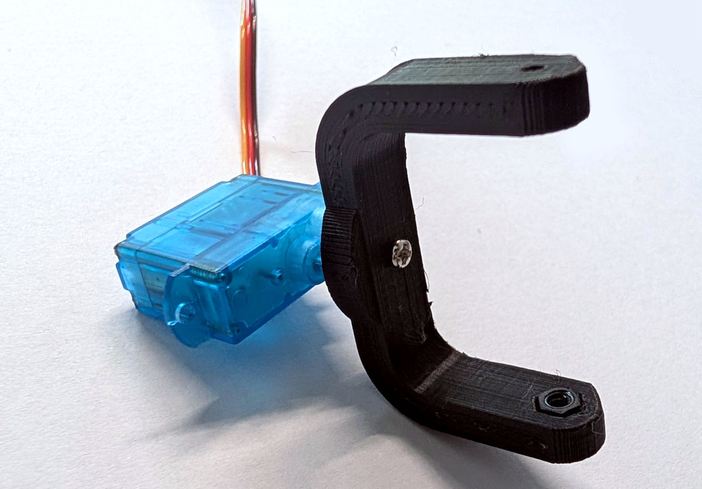

## 4. Join `Neck` and `Head`

1. [Center](#center-a-servo) the servo already inside `Head`.
2. Take the `Neck` assembly from §3. **First stage:** fit `Neck` onto the Head servo shaft — `Neck` has a dedicated pocket for that shaft. Gently push the Head cables aside if needed so the shaft seats fully.
3. **Second stage:** slide `Neck` further onto `Head` until the side with the M2 nut sits flush with `Head` and lines up with the mounting hole on that side. Keep the nut in its hex pocket so it does not fall out.
4. At 90°, `Neck` must sit **perpendicular** to `Head`. Adjust before fastening if needed.
5. Fasten `Neck` to `Head`:
   - Robot’s right: M2 screw into the captured nut (M2×8 mm works).
   - Robot’s left: the mounting screw that came with the servo.
6. Unplug the Head servo from the PCA9685 before continuing.

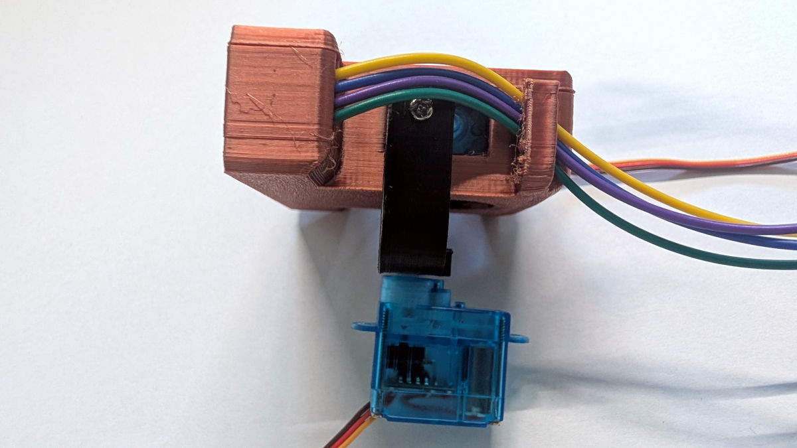

## 5. Chest — side servos

1. Take the printed `Chest`.
2. Seat **two** unused servos in the side pockets (left and right). No horns yet. Shaft orientation does not matter — you will calibrate later.
3. Route each servo lead through the **vertical tunnel at the front** of `Chest` so the connectors exit from the **bottom** of the part.
4. Fasten both servos with **four M2 screws** total — two per servo (M2×16 mm works). Do not overtighten.

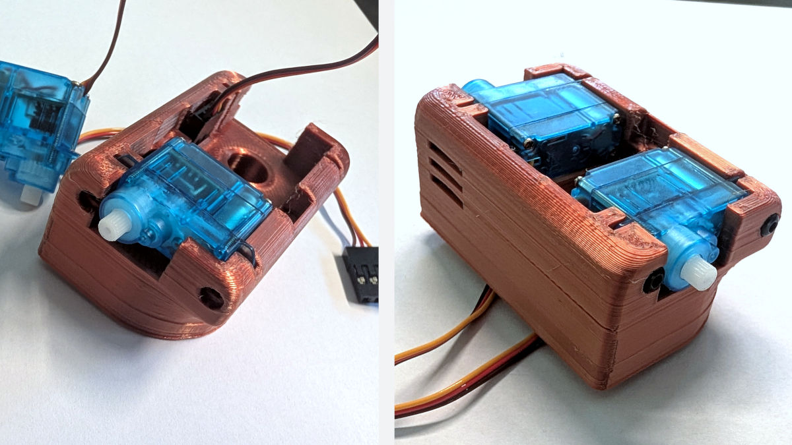

## 6. Mount head assembly on `Chest`

1. Take the joined `Head` + `Neck` from [§4](#4-join-neck-and-head). The servo already fastened to `Neck` goes into the **center** servo pocket in `Chest`.
2. **Before** seating that servo, route its lead through the **central tunnel** in `Chest` and out the **bottom** of the part.
3. Seat the Neck servo fully in the center pocket. Keep front of `Head`/`Neck` on the same side as front of `Chest` (the side with the cable tunnels).
4. Fasten it to `Chest` with M2×8 mm screws. Prefer two screws; if space is tight, one screw at the back of the robot is enough.

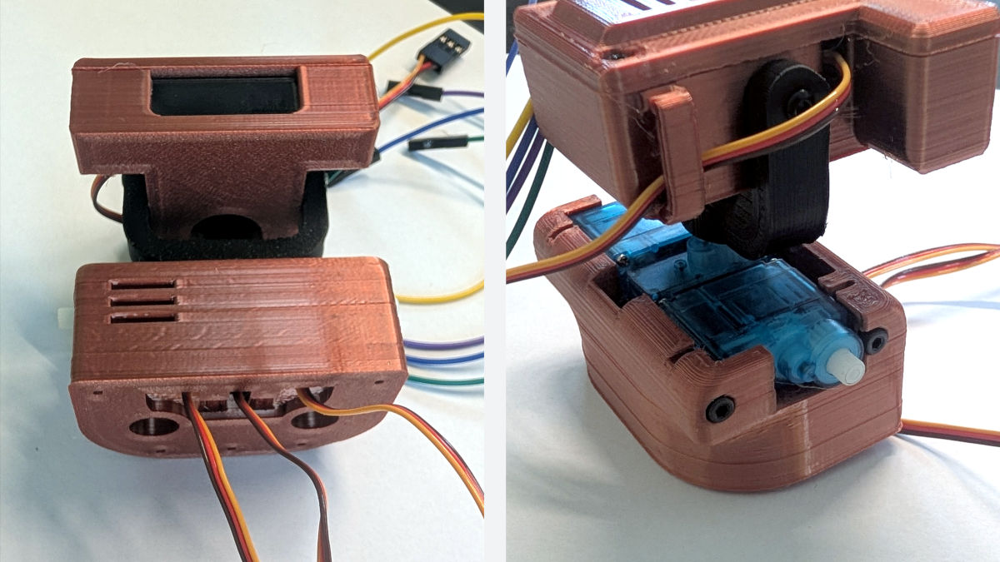

## 7. Belly — last servo

1. Take the **last** unused servo. [Center it](#center-a-servo).
2. Press `Belly` onto the servo shaft — `Belly` has a dedicated pocket for the shaft. Do **not** use a plastic horn.
3. Orient the servo **perpendicular** to `Belly`, with the longer end of the servo body toward the **rounded** side of `Belly`.
4. When alignment is correct, fasten with the **screw that came with the servo**.
5. Unplug this servo from the PCA9685 before continuing.

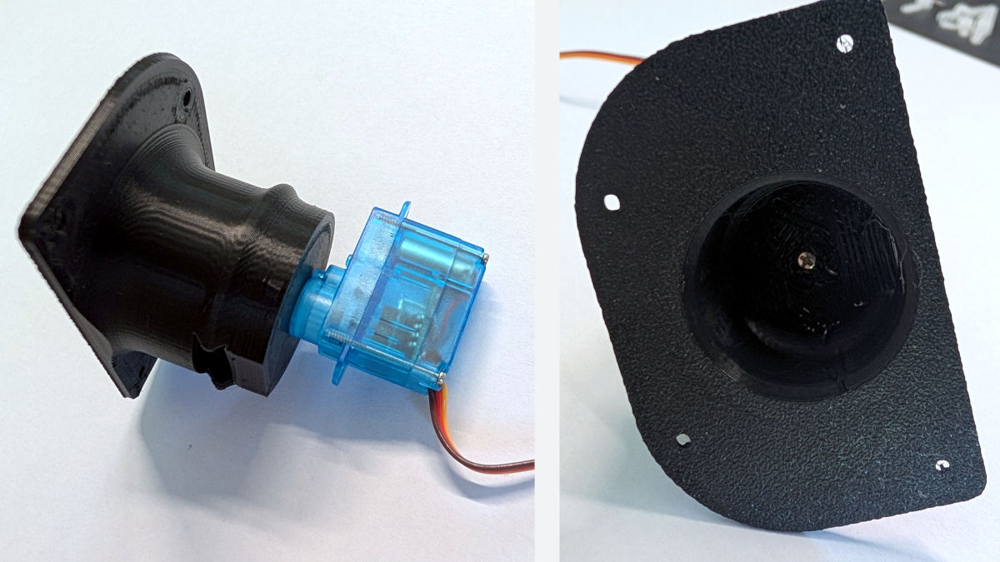

## 8. Route chest cables through `Belly` and join

1. Take the three servo leads that exit the bottom of `Chest`: Neck (center) and the two side (hand) servos.
2. Pass them into `Belly` through the **large upper** opening, then out through the **lower side** opening.
3. Keep the same left-to-right order as they leave `Chest`: **left hand → neck → right hand**. That order is only an identification aid for later — not the PCA9685 channel sequence.
4. Orient `Belly` so its rounded side faces the **back** and matches the profile of `Chest`, then fasten with **four M2 screws** (M2×8 mm works).

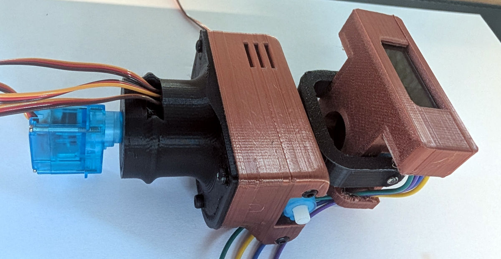

## 9. Seat the body in `Chair`

1. Take the robot body (`Head` through `Belly`). The servo already fastened to `Belly` goes into the dedicated pocket in `Chair`.
2. Orient so the front of the robot matches the front of the chair (the way the figure sits).
3. Route that servo’s lead through the **vertical tunnel** in `Chair` and out under the chair.
4. Slide `SeatLeft` and `SeatRight` in from the sides onto the rails / pockets on `Chair`. The seats lock the body servo in place so it cannot drop out of `Chair`. Watch the cables — do not pinch or crush them while seating the parts.
5. Fasten the two seat parts to each other with **two M2 screws** (M2×16 mm works).

This finishes the **main robot body**. Set it aside — next steps build the desk.

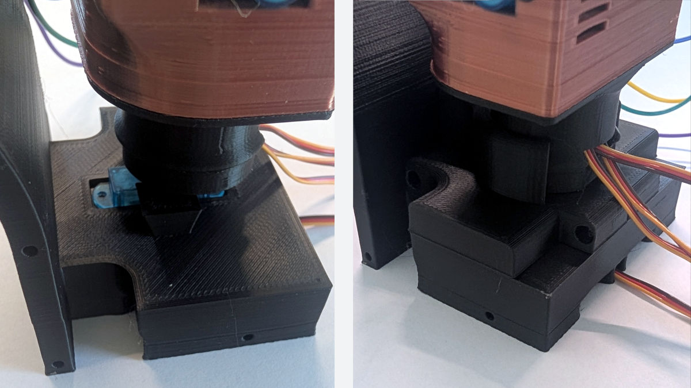

## 10. Desk top stack

1. Take `DeskTop`, `DeskPad`, and `Desk`.
2. Seat `DeskTop` into `DeskPad` — the parts nest together.
3. Place that stack onto `Desk`. Orient so the rounded cutout faces the robot (the side where the figure sits).
4. Fasten through the four corner holes with **four M2 screws** (M2×16 mm works).

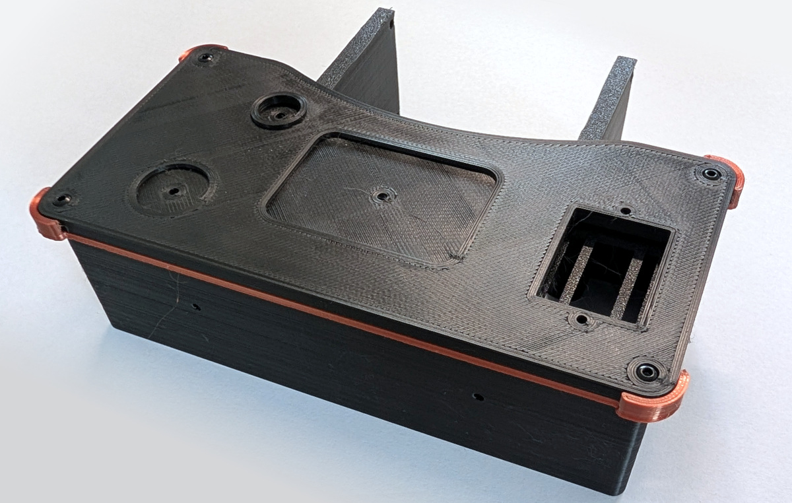

## 11. Desk emblem

1. Place `AiEmblem` on the front of the desk.
2. Fasten with **two short M2 screws** (M2×4 mm works).

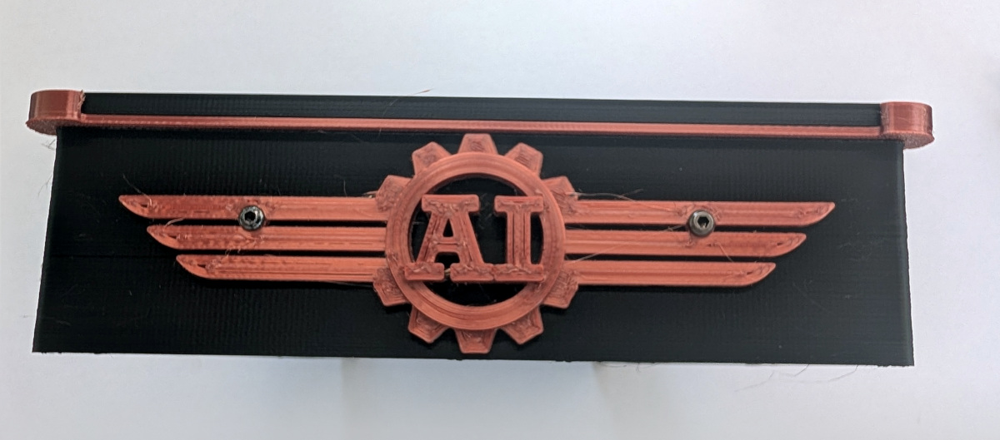

## 12. Electronics inside the desk

By this point the boards should already be wired and soldered together as one harness ([wiring](../hardware/wiring.md)). This step only **mounts** that assembly into `Desk`.

**Leave disconnected for now:**

- ESP32 — do not attach the gold-pin jumper cables to the ESP32 pins yet
- PCA9685 — do not plug any servo connectors into the PCA9685 yet

Everything else in the harness stays as already soldered and assembled.

1. **USB-C breakout (Adafruit 5993)** — fasten with four longer M2 screws (M2×16 mm works) and secure with M2 nuts.
2. **PCA9685** — fasten to the rails on the inside of the desk front with four short M2 screws (M2×4 mm works).
3. **MAX98357A** — mount on the single rail on that same inner front wall with two M2 screws (M2×4 mm works).
4. **Speaker** — stick it to an inner wall, or leave it loose inside the desk for now.

Mount in that order — USB first, then PCA9685, then MAX98357A, then the speaker — so later boards are not in the way.

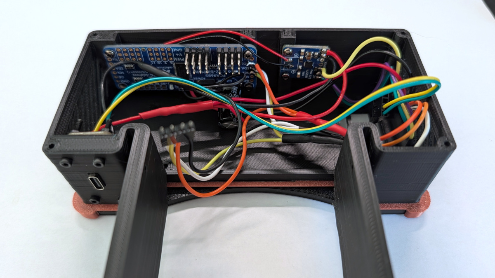

## 13. ESP32, power/AP smoke test, and `LampBase`

1. Seat the **ESP32-C3-Zero** in the opening in the desk top from above. The pins must pass through the holes in the top; the module should sit flush in the recess and not stick up above the desk surface.
2. From underneath, connect the gold-pin jumper cables to the ESP32.
3. **Power/AP smoke test** (optional but recommended) before locking the module in:
   - Confirm every wire is on the correct pin ([wiring](../hardware/wiring.md)). You can ignore servo plugs and the OLED for now — those come later.
   - Firmware should already be on the board (flashed before servo centering).
   - Apply power. The ESP32 LED should light and the board should start the **setup access point** for configuration.
   - If that looks good, **disconnect power**.
4. Place the printed `LampButton` under `LampBase` so it can press the ESP32 **reset** button from above — keep that access easy.
5. Orient `LampBase` so its opening sits over the ESP32 status LED.
6. Fasten `LampBase` to the desk with **two M2 screws** (M2×8 mm works). This also holds the ESP32 from above.

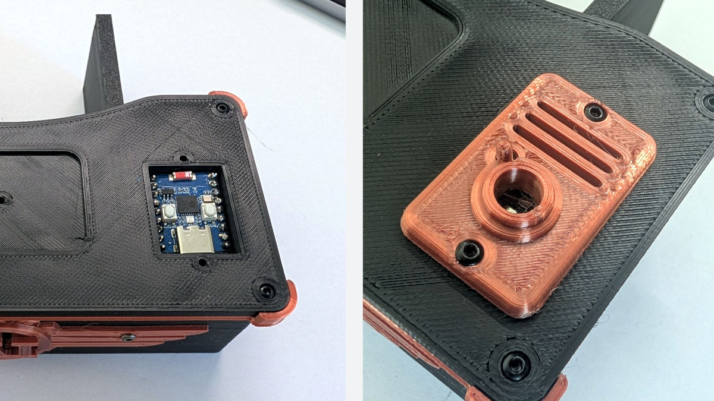

## 14. Desk props — laptop, mug, bell

1. **Laptop** — slide `LaptopScreen` into the pocket on the underside of `LaptopCase`. Place the laptop on the desk and fasten with one M2 screw from under the desk (M2×8 mm works).
2. **Mug** — seat `Coffee` inside `Mug`. Place the mug in its dedicated spot on the desk and fasten the same way: one M2 screw from under the desk (M2×8 mm works).
3. **Bell** — first drive the M2 screw fully into `Bell` alone (M2×16 mm works). Then, with the screw already in the bell, drive that screw down into the desk from above and secure with an M2 nut underneath.

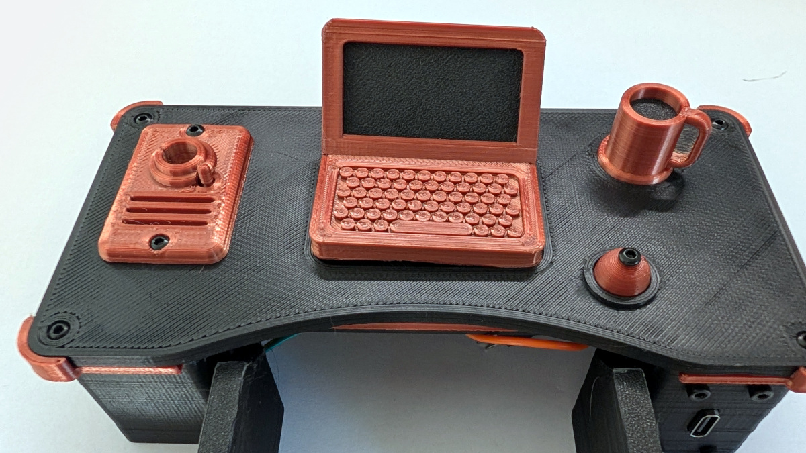

## 15. Connect servos and OLED

Easiest with the desk tipped onto its front wall so the PCA9685 plugs face up, and the seated robot body beside it.

1. Plug every servo lead and the OLED cable into the harness.
2. Use the correct PCA9685 channel order ([pinout](../hardware/pinout.md#pca9685-channels-not-esp32-gpio)):

   | Channel | Joint |
   | --- | --- |
   | 0 | Head pitch |
   | 1 | Neck yaw |
   | 2 | Left hand |
   | 3 | Right hand |
   | 4 | Body / torso |

   The left-to-right order through `Belly` is only an ID aid — **not** the channel sequence. Map explicitly:

   | Lead (as routed through Belly) | Channel |
   | --- | --- |
   | Left hand | 2 |
   | Neck | 1 |
   | Right hand | 3 |

   Head pitch → channel **0**. Body / torso (Belly servo under the chair) → channel **4**.
3. Power up and run a **servos + OLED smoke test**: servos respond, OLED shows something sensible, no brown-out or odd movement. If something is wrong, power down before swapping plugs.

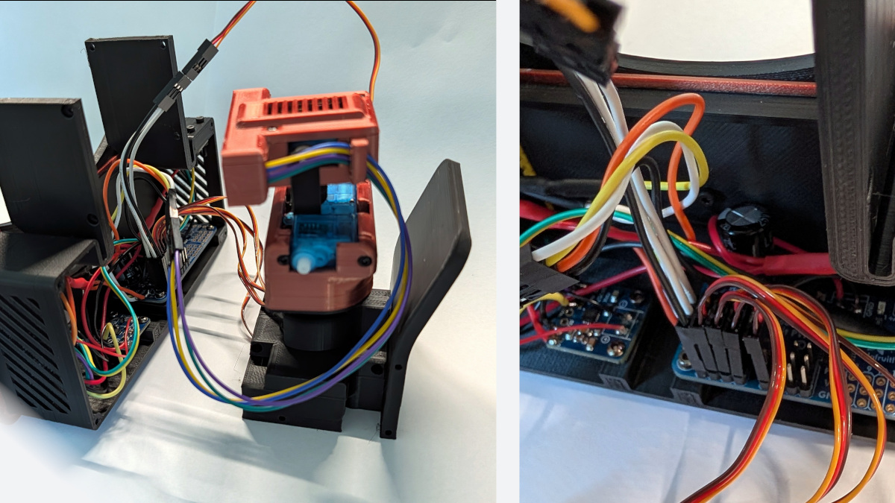

## 16. Fasten `Chair` to `Desk`

1. Gently slide the desk up to the chair so the mounting holes on the desk (back / armrest sides) line up with the matching holes on `Chair`.
2. Fasten with **six M2 screws** total — three per side (M2×8 mm works). Do not force the parts; keep cables clear of the screw paths.

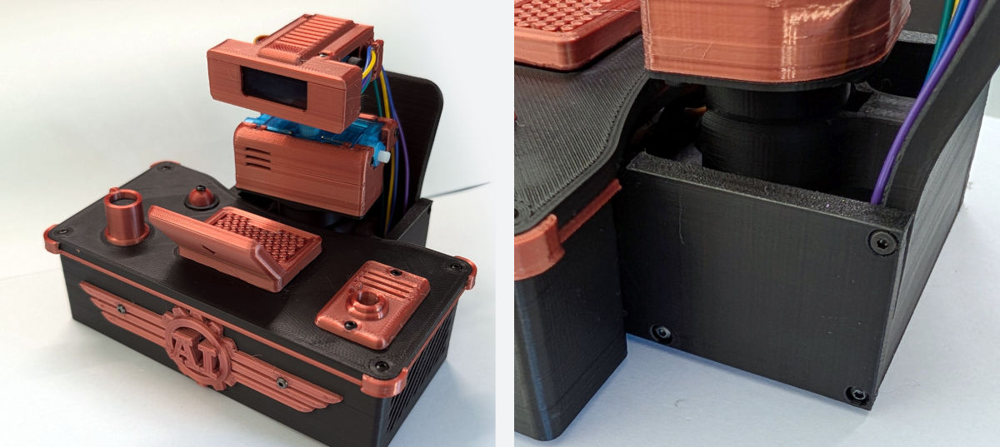

## 17. Arms — elbow joints

Build the arm assemblies only — do **not** mount them on the chest servos yet.

1. At each elbow there is a screw hole joining the forearm to the upper arm.
2. Fasten left and right the same way: `ForearmLeft` to `UpperArm` and `ForearmRight` to `UpperArm` with one M2 screw per elbow (M2×8 mm works). Print / use two `UpperArm` parts (one per side).

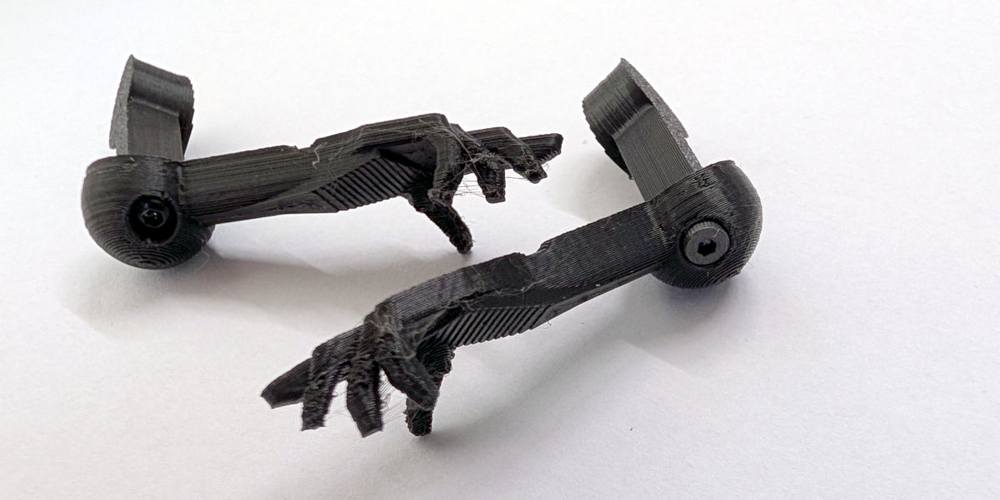

## 18. Mount arms on the chest servos

1. [Center](#center-a-servo) the side (hand) servos first.
2. Press each arm assembly onto its chest servo shaft. The upper arms have dedicated pockets for the shafts.
3. With the servos at 90°, set each arm so the hand sits at about shoulder height and the forearm points forward (toward the desk).
4. When the pose looks right, fasten each arm with the mounting screw that came with that servo.
5. Do this for both arms. If centering is not perfect, that is fine — you will refine it in the setup calibration later.

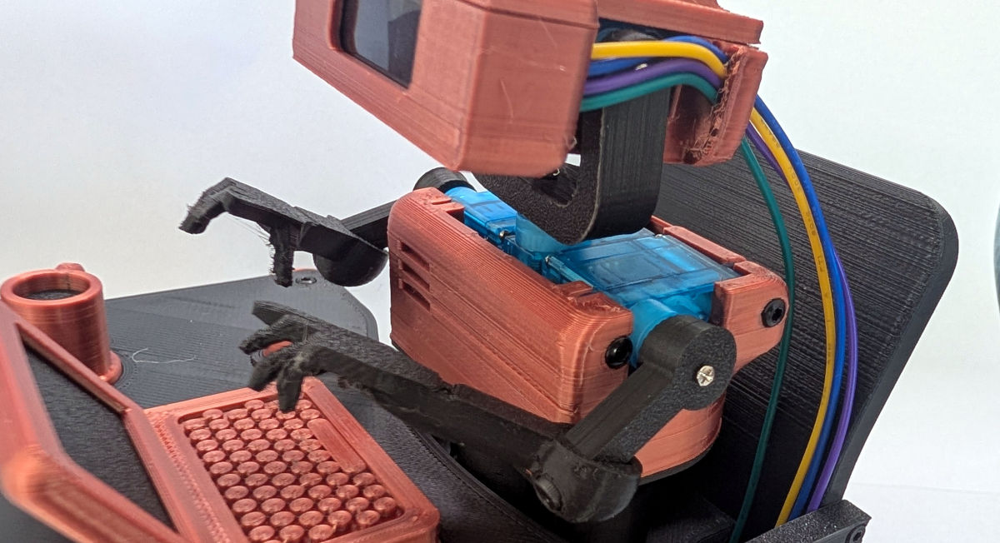

## 19. Lamp (press-fit)

No screws — everything is a friction fit.

1. Place `LampCap` onto `LampDiffuser`.
2. Push that stack into the opening in `LampBase`.

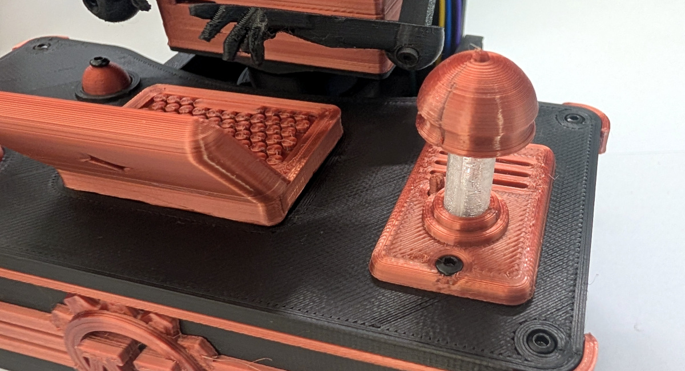

## 20. Setup wizard and first boot on Wi‑Fi

The robot is built. What remains is servo calibration, Wi‑Fi, and a quick check that everything works.

1. Connect power. The board should start the **setup access point**.
2. Join that Wi‑Fi and open the configurator (`http://192.168.4.1/config`).
3. Walk through the **entire setup wizard** (servo ranges, OLED, LED, speaker, hostname / home Wi‑Fi) — [getting started → Wi‑Fi setup](../getting-started.md#5-wi-fi-setup).
4. When the wizard is finished, **disconnect power**, then power on again.
5. The robot should join your home network and expose the **REST API**. Prove it with the web UI or a curl — [getting started → Prove it](../getting-started.md#6-prove-it), [api.md](../api.md).

## Related

| Topic | Doc |
| --- | --- |
| Parts inventory / printables | [3d_models/README.md](../../3d_models/README.md) |
| Print or order parts | [getting-started.md → Print and mechanical](../getting-started.md#2-print-and-mechanical) · [order-parts.md](order-parts.md) |
| Different servo size / CAD params | [parametric-design.md](parametric-design.md) |
| Servo axes and safe ranges | [robot-movement.md](../robot-movement.md) |
| Wire and power after assembly | [hardware/wiring.md](../hardware/wiring.md) · [hardware/README.md](../hardware/README.md) |
| Full build path | [getting-started.md](../getting-started.md) |
