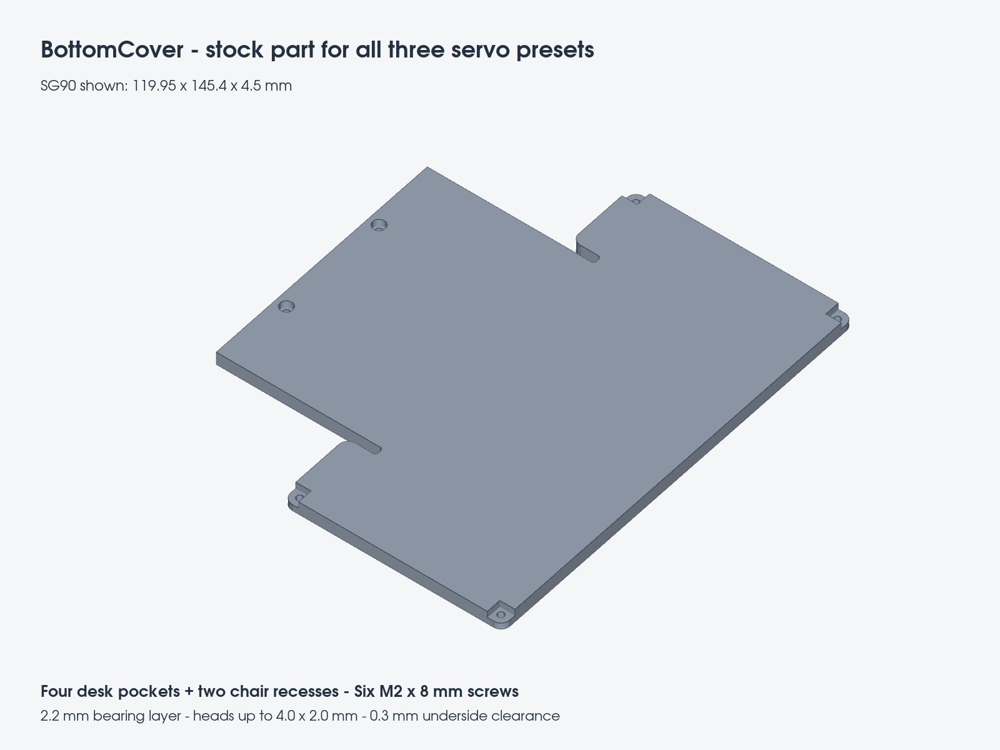
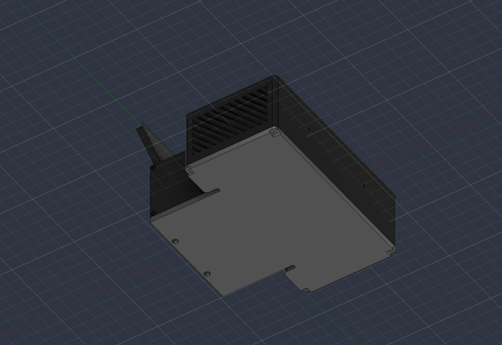
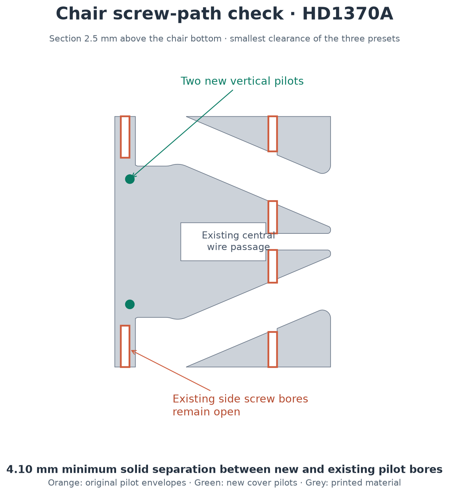

# Bottom cover

`BottomCover` closes the underside of the desk and chair with six recessed M2×8 screws: four in the desk's existing vertical pilots and two in new reinforced blind pilots in `Chair`. It is a stock part for **FS0307, SG90, and HD1370A**, included in the black `PartsSetB` aggregate.

## Source and print files

Edit only [`TinyEngineer.f3d`](../../3d_models/cad/TinyEngineer.f3d). `BottomCover` is a native parametric component in the assembly, with linked occurrences under `PRINT_LAYOUT` and `PRINT_LAYOUT/PartsSetB`. Features are grouped beside their component creation; placement joints follow the component features. No separate fixed-size Fusion source is needed.

Use `BottomCover`, `Chair`, and `PartsSetB` from the matching `3d_models/parts/{servo_id}/` folder. The updated chair is required for the two rear fasteners; an older printed chair without those pilots needs reprinting. Individual `BottomCover.3mf` files: [FS0307](../../3d_models/parts/fs0307/3mf/BottomCover.3mf), [SG90](../../3d_models/parts/sg90/3mf/BottomCover.3mf), [HD1370A](../../3d_models/parts/hd1370a/3mf/BottomCover.3mf). Matching STL and STEP files are alongside them.

Print with the **mating face down and head pockets up**, as exported. No supports are needed. The opposite face remains flat for resting on a desk, with the specified screw heads recessed 0.3 mm. Assembly and cable routing: [close the underside](assembly.md#close-the-underside-with-bottomcover).

## Geometry and fasteners

The cover projects the desk's existing bottom perimeter, including its arcs and shoulder transitions, and closes the rear edge across the chair. It does not add bevels to the chair's square rear corners. Shaft centers reference the existing desk pilots and new chair pilots. Changing the servo preset updates these references and the print poses.

| Feature | Default / expression |
| --- | --- |
| Overall thickness | 4.5 mm: bearing layer + recess depth |
| Bearing layer above the heads | 2.2 mm: `min_wall_thickness + 0.7 mm` |
| Head-pocket depth | 2.3 mm: `screw_head_height + clearance` |
| Shaft clearance | 2.3 mm: `2 mm + clearance` |
| Chair head recess | Ø4.3 mm: `screw_head_diameter + clearance` |
| Chair pilot | Ø2.1 mm: `screw_thread_diameter`; set using `ScrewSizingTest` |
| Chair blind pilot depth | 6.1 mm: 8 mm screw − bearing layer + clearance |
| Chair reinforcement | Ø7.3 mm, 7.6 mm tall; blind-hole roof ≥ `min_wall_thickness` |
| Hardware | Six M2×8 thread-forming pan/button-head screws; heads ≤ Ø4.0 × 2.0 mm |

The four desk-corner head pockets open to the outside. A closed Ø4.3 mm counterbore at the existing corner centers would leave only a 0.85 mm outer rim, below `min_wall_thickness` (1.5 mm). The open pockets remove that thin rim while retaining the full 2.2 mm bearing layer. The two chair recesses retain at least 1.5 mm to the rear edge.

The shaft holes in the cover do not retain the threads; the desk and chair pilots do. No nuts or new screw lengths are required. Use the repository's [pilot-sizing procedure](parametric-design.md#m2-screw-holes) before printing structural parts.

## Screw and wire clearances

The new chair pilots are separated from the existing side screw bores. Sweeping a nominal Ø4 mm head along the full existing pilot lengths leaves at least 1.5 mm to the new reinforcement; the lowest side-screw heads remain 0.5 mm above the cover mating plane. Reinforcement adds no material inside those bores or the checked central passage at the chair foot. Keep real wires inside that passage and the desk cavity, away from the cover mating face and screw insertion paths; the cable harness is not represented by the CAD check.

| Preset | Cover size (mm) | New-to-existing chair pilot clearance | Conservative desk screw-tip gap |
| --- | --- | --- | --- |
| FS0307 | 104.00 × 130.60 × 4.50 | 4.45 mm | 12.70 mm |
| SG90 | 119.95 × 145.40 × 4.50 | 8.15 mm | 24.40 mm |
| HD1370A | 104.30 × 129.20 × 4.50 | 4.10 mm | 12.20 mm |

Chair clearances measure between the full new 6.1 mm-deep pilot cylinders and the existing pilot envelopes, so the 5.8 mm screw engagement fits within the checked volume. Desk gaps conservatively allow the top M2×16 screw to enter the desk by its entire 16 mm, opposite the cover screw's 5.8 mm engagement. The actual top stack reduces that insertion further.

## Validation

CAD validation only; **no physical test of this revised six-hole cover or chair has been completed**. Printed fit, screw grip, cable placement, and final stability require a test-fit.

The [recorded checks](bottom-cover-checks.json) include source/export hashes and measurements:

- Applied all three presets using the repository's Servo Configurator implementation: zero errors or warnings in the complete native timeline; all three new cover sketches fully constrained.
- Checked the cover against every other main assembly occurrence: zero solid interference. Checked its black-set copy against the other set members: zero interference.
- Compared the mating outline against the native desk perimeter: zero measured excess or missing area; six hole axes aligned within 0.00001 mm calculation tolerance.
- Confirmed that the new chair material leaves the existing pilot bores and the checked central passage open.
- Exported `BottomCover`, `Chair`, and `PartsSetB` for every preset through the repository's Parts Exporter implementation: 27 files, with no hand-edited meshes or STEP files.
- Tested all six nominal Ø4 × 2 mm heads in every preset: zero collision when seated and positive collision with the bearing layer after a 0.1 mm upward move; 0.3 mm floor clearance.
- Independently checked all STEP solids and all 3MF/STL meshes: valid/watertight, positive volume, correct solid counts (1, 1, and 14), and print-bed minimum Z = 0. STEP/mesh volume differences are below 0.2%.
- Reopened the saved `.f3d`: SG90 default, zero timeline errors/warnings; inspected the underside and chair mounts in Fusion.

To re-export after a change, follow [adding parts](adding-parts.md): cycle every servo in Servo Configurator, inspect the assembly and print layout, then select these three affected parts in Parts Exporter with all presets and all three formats. The largest `PartsSetB` is approximately 235 × 332 mm; use individual parts on a smaller home bed.
