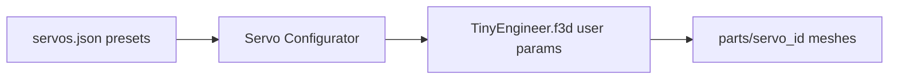
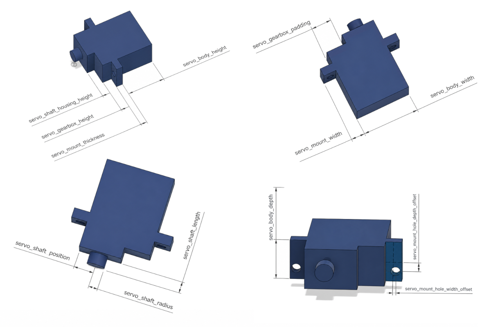

# Parametric design (different servo sizes)

[`3d_models/cad/TinyEngineer.f3d`](../../3d_models/cad/TinyEngineer.f3d) is the parametric Fusion source for the robot. Printed pockets, mounting tabs, and shaft clearance are driven by Fusion **user parameters**. Change those values and the assembly rebuilds for a different micro servo.

Presets live in [`servos.json`](../../3d_models/fusion/TinyEngineerTools/servos.json). **TinyEngineer Tools** writes them into the `.f3d`, then exports print meshes under `parts/{servo_id}/3mf/` (and matching `stl/`) plus STEP CAD under `parts/{servo_id}/step/`.

## Which servo

Servo size sets the size of the **whole robot**. Desk, chair, body, and pockets all scale with the preset. Pick the servo first, then print the matching `parts/{servo_id}/3mf/` folder.

Built-in presets in [`servos.json`](../../3d_models/fusion/TinyEngineerTools/servos.json):

| Model | `servo_id` | When to use |
| --- | --- | --- |
| **Tower Pro SG90** (recommended) | `sg90` | Easiest to buy. Bigger desk — electronics are easier to fit and assemble. |
| **Feetech FS0307** | `fs0307` | More compact. Looks better if you want a smaller robot. |
| **PowerHD HD-1370A** | `hd1370a` | Still supported for backward compatibility. Not the pick for a new build. |

A non-standard servo is fine: measure it, add a preset, run the configurator ([Add a new servo](#add-a-new-servo)). Print parts that match that `servo_id`.

Print matching `parts/{servo_id}/3mf/`: [`sg90`](../../3d_models/parts/sg90/3mf/), [`fs0307`](../../3d_models/parts/fs0307/3mf/), [`hd1370a`](../../3d_models/parts/hd1370a/3mf/).

## Servo parameters

Each preset in `servos.json` is a map of Fusion user-parameter names to expressions such as `"20 mm"`. The configurator ([`servo.py`](../../3d_models/fusion/TinyEngineerTools/servo.py)) writes those into the open design. It refuses names that are not already user parameters in the `.f3d` — do not invent keys.

### Body and tabs

| Parameter | Meaning |
| --- | --- |
| `servo_body_width` | Body length between the two mounting tabs (tabs not included). |
| `servo_body_height` | Body height, from the mounting-tab plane to the opposite face. |
| `servo_body_depth` | Body thickness (front to back). |
| `servo_mount_width` | How far each mounting tab sticks out from the body. |
| `servo_mount_thickness` | Tab thickness. |

### Gearbox and shaft stack

| Parameter | Meaning |
| --- | --- |
| `servo_gearbox_height` | Gearbox step sitting on the body. |
| `servo_shaft_housing_height` | Boss around the output shaft, above the gearbox. |
| `servo_gearbox_padding` | How far the gearbox / shaft stack is inset from the body edge (the asymmetric “fat” side of typical micro servos). |

### Shaft

| Parameter | Meaning |
| --- | --- |
| `servo_shaft_position` | Distance from the body end to the shaft axis. |
| `servo_shaft_length` | How far the spline shaft sticks out. |
| `servo_shaft_radius` | Shaft radius (not diameter). |

### Mount holes

`servo_mount_hole_radius` is in `servos.json` but not drawn on the diagram.

| Parameter | Meaning |
| --- | --- |
| `servo_mount_hole_depth_offset` | Hole shift along body depth from the tab centerline. |
| `servo_mount_hole_width_offset` | Hole shift along the tab (toward or away from the body). |
| `servo_mount_hole_radius` | Screw-hole radius in the tabs. |

### Not a dimension

| Parameter | Meaning |
| --- | --- |
| `servo_id` | Short lowercase folder id (`hd1370a`, `fs0307`, `sg90`). The configurator writes it; the exporter uses it. |

## TinyEngineer Tools add-in

**TinyEngineer Tools** is a Fusion add-in for [`cad/TinyEngineer.f3d`](../../3d_models/cad/TinyEngineer.f3d). It writes servo dimensions from [`TinyEngineerTools/servos.json`](../../3d_models/fusion/TinyEngineerTools/servos.json) into Fusion user parameters, and exports each `PRINT_LAYOUT` child as a `.3mf` and binary `.stl` mesh plus a `.step` CAD file (PRINT_LAYOUT with one child visible, so captured print pose stays). STL/3MF use Save as Mesh; STEP uses File → Export.

Fusion must know about the add-in folder. Folder name, `TinyEngineerTools.py`, and `TinyEngineerTools.manifest` must stay the same.

Official Autodesk steps: [How to install an add-in or script](https://www.autodesk.com/support/technical/article/caas/sfdcarticles/sfdcarticles/How-to-install-an-ADD-IN-and-Script-in-Fusion-360.html).

### Point Fusion at this repo

Fusion remembers the path. Code stays in git. Reload after edits (see below).

1. Open Fusion.
2. Open **Utilities → Add-Ins → Scripts and Add-Ins**. Shortcut: **Shift+S**.
3. Open the **Add-Ins** tab.
4. Click the green **+** next to **Script of add-in from device**.
5. Browse to `3d_models/fusion/TinyEngineerTools/` in this repo and select the folder.
6. Select **TinyEngineerTools** in the list and click **Run**.
7. Optional: enable **Run on Startup** so Fusion starts it every launch.

### Use the commands

Open [`cad/TinyEngineer.f3d`](../../3d_models/cad/TinyEngineer.f3d) and stay in the **Design** workspace. Both commands live under **Utilities → Add-ins**.

#### TinyEngineer Servo Configurator

Select a servo model and apply dimensions, including `servo_id` (short lowercase id such as `sg90`).

The command reads [`servos.json`](../../3d_models/fusion/TinyEngineerTools/servos.json), previews the values, and writes them into the design’s user parameters. Apply a servo before exporting.

#### Tiny Engineer Parts Exporter

Choose an export folder.

The add-in finds the `PRINT_LAYOUT` component and exports each of its direct child components separately. For each child, it temporarily hides the others, keeps that child visible in its saved print orientation, and exports the full PRINT_LAYOUT as:

* `{servo_id}/3mf/{name}.3mf`
* `{servo_id}/stl/{name}.stl` in binary STL format
* `{servo_id}/step/{name}.step` as STEP CAD (File → Export, not Save as Mesh)
* `{servo_id}/README.md` with that servo’s parameters from `servos.json`

`servo_id` comes from the Fusion parameter set by Servo Configurator. Apply a servo before exporting.

In that way, each component is exported as a separate file, all keeping their captured print orientation.

After all components are exported, the original visibility settings are restored. A progress dialog stays up during the run so Fusion can paint; Cancel stops after the current part.

## Add a new servo

1. Measure a real unit (prefer calipers over datasheet marketing sizes).
2. Copy an existing object in [`servos.json`](../../3d_models/fusion/TinyEngineerTools/servos.json); keep the same keys; set a unique `servo_id`.
3. Reload the add-in, run Servo Configurator, confirm Fusion parameters update.
4. Print `ServoSizingTester` first, then export.

The configurator refuses unknown Fusion parameter names. Do not invent keys that are not already user parameters in the `.f3d`.
