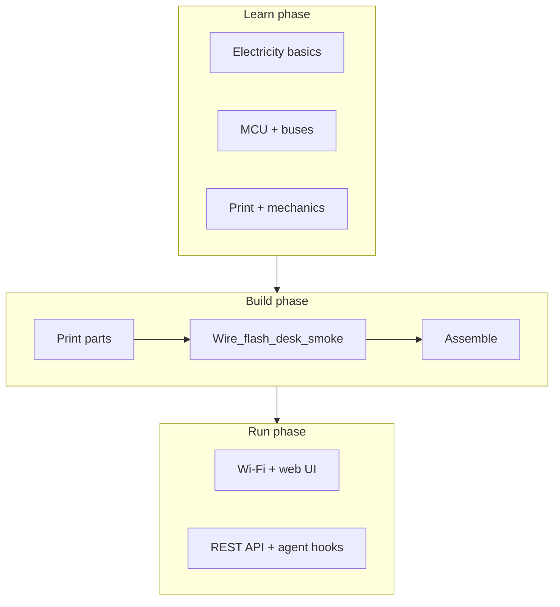
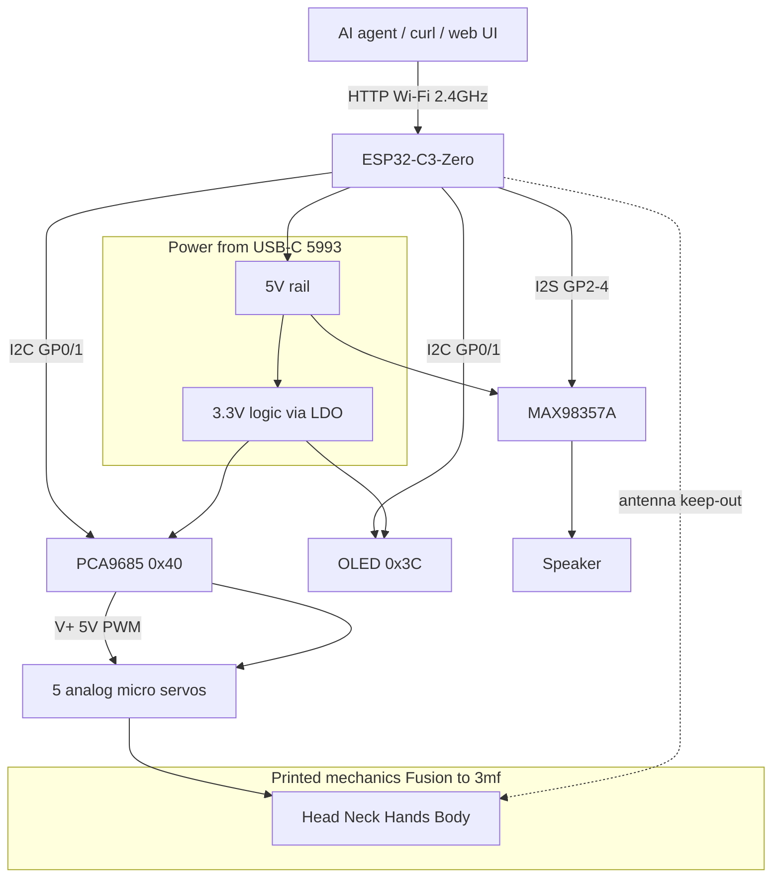

# How it all fits together

You've read the pieces. This chapter closes the loop on the guide's goal — **from software-only to hardware-capable** — then hands you to the build checklist. Tiny Engineer is the capstone: one system where electricity, firmware, buses, print, and motion connect. The vocabulary you picked up travels with you to the next board.

**Expect medium difficulty overall** — not an entry-level blinky kit, but a fair first hardware build for a software engineer who read the guide and validates electronics on the desk (wire + flash) before closing the chest. Hardest areas for most SWEs: wiring density, servo mechanics, power under load. Easiest: REST and Wi-Fi once that smoke check is solid.

---

## Three phases

**Learn** — this guide. Enough to not fry boards.

**Build** — [getting-started.md](../getting-started.md). Checklist: shop, print, wire, flash, assemble, wizard, prove.

**Run** — Wi-Fi, `/anim`, Cursor hooks or your own integration.

You can overlap phases (print while reading). Don't skip **desk smoke** (serial, PCA9685, one servo) before seating the harness in the chest.

---

## The whole robot — one diagram

**Control plane:** Wi-Fi HTTP from your LAN.

**Data paths:** I2C for servos (via PCA9685) and display; I2S for audio.

**Power plane:** One 5 V in; 3.3 V logic derived; servos on 5 V motor rail.

**Mechanical plane:** Fusion CAD → printed parts → servos → pose.

---

## Subsystem → chapter map

| Subsystem | Learn in | Operate with |
| --- | --- | --- |
| Volts, amps, GND, two domains | Ch. 01, 07 | [power.md](../hardware/power.md) |
| ESP32-C3, GPIO, USB, antenna | Ch. 02 | [pinout.md](../hardware/pinout.md) |
| Wires, schematic reading | Ch. 03 | [wiring.md](../hardware/wiring.md), [diagram](../wiring/Tiny%20Engineer.drawio.png) |
| I2C, I2S, PWM | Ch. 04 | [interfaces.md](../hardware/interfaces.md) |
| Servos, horns, joints | Ch. 05 | [robot-movement.md](../robot-movement.md), [servos.md](../hardware/servos.md) |
| Print, PLA/PETG, Fusion | Ch. 06 | [3d_models/README.md](../../3d_models/README.md) |
| Supply sizing, brownout | Ch. 07 | [power.md](../hardware/power.md) |
| pio, serial, bisect debug | Ch. 08 | [testing.md](../hardware/testing.md) |
| HTTP API, agents | — (after hardware) | [api.md](../api.md), [integration.md](../integration.md), [hooks.md](../hooks.md) |

---

## Recommended build strategy (software brain edition)

Follow the checklist in [getting-started.md](../getting-started.md). Summary:

1. **Shop** → [shopping.md](../shopping.md)
2. **Print or order** (can overlap with learning) → [3d_models](../../3d_models/README.md)
3. **Wire** + **flash** on the desk → [wiring.md](../hardware/wiring.md), [flash.md](../flash.md)
4. **Assemble** (one run: Head/Hat, centering, joins) → [assembly.md](../3d/assembly.md) §§1–19
5. **Setup wizard** → assembly §20
6. **Prove** (`/health`, `ring`) → [getting-started §7](../getting-started.md#7-prove-it)
7. **Agent hooks** → [hooks.md](../hooks.md) / [integration.md](../integration.md)

**Desk smoke is first:** with boards still on the desk, confirm serial boot, PCA9685 OK, and one servo via `/test/servo` or setup AP **Move all to 90°**. Then one mechanical run. Do not finish the wizard until §20.

**Temptation to avoid:** printing everything beautifully before verifying electronics. Pretty plastic won't fix a swapped SDA/SCL.

---

## Confidence milestones

Check these off — order matches the checklist:

| # | Milestone | When | How you know |
| --- | --- | --- | --- |
| 1 | **Continuity sanity** | wire | No short 5V–GND; GND common (meter, power off) |
| 2 | **Serial boot** | flash | `pio device monitor` shows boot log, dim green LED |
| 3 | **PCA9685 detected** | flash | Serial OK; missing = 1 red blink, hang ([blink codes](../hardware/testing.md#boot-failure-blink-codes)) |
| 4 | **One servo / 90°** | flash | Setup AP **Move all to 90°** or `/test/servo` moves a channel |
| 5 | **Joints in safe range** | assembly §§1–19 | Each joint centered and joined; no stall buzz |
| 6 | **Harness seated** | late assembly | Same electronics checks still pass after mounting in the chest |
| 7 | **Wi-Fi stable** | after §20 wizard | `/health` over `tiny-engineer.local` or OLED IP |
| 8 | **Audio + full anim** | prove it | e.g. `ring` — motion + sound (if silent → `uploadfs`) |
| 9 | **Agent** | optional | Cursor hook or script triggers `/anim` |

Stuck on a milestone? Back one step, read [Ch. 08](08-tools-debugging-and-embedded-workflow.md) and [testing.md](../hardware/testing.md).

---

## What I'd tell any software engineer starting hardware

Not specific to day one on Tiny Engineer — things that stayed true across projects:

1. **Two voltages, one GND** — not optional mental model
2. **PCA9685 isn't optional** — plan I2C before servos
3. **Power is a feature** — 2 A supply saves hours of "random reboot" debugging
4. **Horns are calibration** — software clamps can't fix physical collision
5. **Wire + flash on the desk first, then one mechanical run** — smoke before closing the chest
6. **The docs split on purpose** — this guide for *why*, getting-started for *do*, hardware/ for *lookup*

The meta-lesson: hardware rewards the same curiosity that got you into software, but feedback is louder — smoke, buzz, heat. That's part of the fun.

---

## Handoff — go build

You're done with concepts when the milestones make sense and you know which doc to open for pin numbers.

**Operational checklist:** [getting-started.md](../getting-started.md)

**Shop → print → wire → flash → assemble → wizard → prove → hooks.**

If you're mostly a software person: good. The bar isn't an EE degree — it's curiosity and willingness to probe a wire. In a world where AI spits out code in seconds, there's a particular joy in something on your desk that moves because *you* closed the loop from schematic to screw. Tiny Engineer is a fun capstone — but the bridge you built here works for the next project too.

---

**Next:** none — start building, or re-read any chapter from the [README](README.md).

**Reference:** [getting-started.md](../getting-started.md) · [hardware/README.md](../hardware/README.md) · [README.md](README.md)
