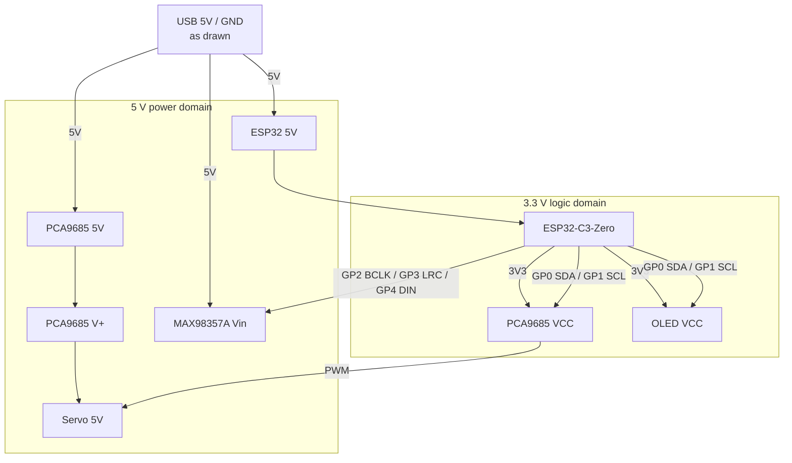

# Tiny Engineer — hardware overview

Canonical hardware reference for the Tiny Engineer robot.

Firmware pin constants live in [`include/pins.h`](../../include/pins.h). The default build is the **main control board** ([main-control-board.md](main-control-board.md)). The advanced path wires separate breakouts ([wiring.md](wiring.md) + drawio) when you add modules the board does not support. Same nets and firmware.

Source of truth: firmware `include/pins.h`, then this `docs/hardware/` set. Modular topology: `docs/wiring/`. PCB connectivity: board `expected-nets.yml` / netlist per [pcb.md](../pcb.md).

| Audience | Use this set for |
| --- | --- |
| Human | Assembly, wiring, power, bring-up, debugging |
| Firmware agent | Pin map, buses, voltages, servo PWM conventions, test sequence |

## Purpose

Small desktop robot with:

- 5 analog micro servos (head, neck, hands, body — [robot-movement.md](../robot-movement.md))
- I2C OLED status display
- I2S speaker for tones and WAV playback
- ESP32-C3 Wi-Fi for HTTP control and AI hooks

Firmware (`src/main.cpp`) is the robot application: Wi-Fi, settings, hardware tests, animations, and the JSON API.

## Hardware architecture

One ESP32-C3 module owns all logic. Servo PWM is offloaded to a PCA9685 so pulse generation does not depend on ESP32 timing. Audio is I2S into a class-D amp. Display and servo driver share one I2C bus. On the default build those chips are on the main control board. The advanced path puts the same chips on breakouts — the diagram is the same either way.

Speaker **SPK+/SPK-**: [main-control-board.md](main-control-board.md). The modular PNG omits them — [wiring.md](wiring.md#not-on-the-drawing).

| Domain | Voltage | What lives there |
| --- | --- | --- |
| Power rail | **+5V** | USB **5V** → ESP32 **5V**, PCA9685 **5V**, MAX98357A **Vin**; PCA9685 **V+** → servo **5V** |
| Logic | **3V3** | ESP32 GPIO, PCA9685 **VCC**, OLED **VCC**, I2C, I2S |
| Ground | **GND** | Every module — common ground is mandatory |

> [!WARNING]
> Never power the servos from the ESP32 3.3 V regulator.

> [!WARNING]
> MAX98357A SPK- is not ground. Speaker connects between SPK+ and SPK- only.

## Major components

| Role | Main control board (default) | Advanced breakouts | Qty |
| --- | --- | --- | --- |
| Controller | Waveshare ESP32-C3-Zero (plugs into board sockets) | same | 1 |
| Servo PWM | PCA9685 on PCB | Adafruit PCA9685 breakout | 1 |
| Actuators | Analog micro servos — **Tower Pro SG90 recommended**; Feetech FS0307 compact; PowerHD HD-1370A still supported | same | 5 |
| Audio amp | MAX98357A on PCB | MAX98357A breakout | 1 |
| Speaker | [Adafruit Mini Oval Speaker - 8 Ohm 1 Watt](https://www.adafruit.com/product/3923) | same | 1 |
| Display | [Waveshare 0.91inch OLED Module](https://www.waveshare.com/0.91inch-oled-module.htm) (SSD1306, 128×32, I2C) | same | 1 |
| Robot USB | USB-C on PCB | Adafruit 5993 USB-C breakout | 1 |

Carts: [shopping.md](../shopping.md). Spec detail: [components.md](components.md). Connect: [main-control-board.md](main-control-board.md).

## Communication buses

| Bus | ESP32 pins | Devices |
| --- | --- | --- |
| I2C | GP0/SDA, GP1/SCL (Waveshare OLED **SCL**) | PCA9685 `0x40`, SSD1306 `0x3C` |
| I2S | GP2/BCLK, GP3/LRC, GP4/DIN | MAX98357A |
| Servo PWM | *(none on ESP32)* | PCA9685 channels 0–4 @ 50 Hz |
| USB | Board USB-C (VBUS/GND + D+/D− → GP19/GP18). Advanced path: 5993 — [wiring.md](wiring.md) | Power, flash, serial CDC |

Details: [interfaces.md](interfaces.md), [pinout.md](pinout.md).

## Power architecture

Single nominal **+5V** supply via the main control board USB-C. ESP32 onboard LDO makes **3V3** for logic only. PCA9685 **V+** (servos) is electrically separate from PCA9685 **VCC** (logic). The advanced path brings 5 V in through an Adafruit 5993 — [wiring.md](wiring.md).

Prefer a **5 V / ≥2 A** source with margin. Details: [power.md](power.md).

## Documentation map

| File | Contents |
| --- | --- |
| [../shopping.md](../shopping.md) | Default cart; advanced extra modules |
| [main-control-board.md](main-control-board.md) | Default connect: ESP32, OLED, servos, speaker |
| [order-main-control-board.md](order-main-control-board.md) | Order the PCB / PCBA (any fab; JLCPCB walkthrough) |
| [components.md](components.md) | Inventory, voltages, limits |
| [pinout.md](pinout.md) | GPIO map + allocation rules |
| [wiring.md](wiring.md) | Advanced: breakout harness |
| [../3d/assembly-modular.md](../3d/assembly-modular.md) | Advanced: mount breakouts in the desk |
| [power.md](power.md) | Budget, brownout symptoms, single-USB policy |
| [servos.md](servos.md) | PWM, test limits, safe ranges |
| [interfaces.md](interfaces.md) | I2C / I2S / PWM / USB |
| [testing.md](testing.md) | Bring-up sequence, failures, what to check |

Modular schematic sketch: [`docs/wiring/Tiny Engineer.drawio`](../wiring/Tiny%20Engineer.drawio) / [PNG](../wiring/Tiny%20Engineer.drawio.png). KiCad: [`hardware/boards/`](../../hardware/README.md); contribution rules: [`docs/pcb.md`](../pcb.md).

## Source-of-truth order

1. Repository firmware / `include/pins.h`
2. This `docs/hardware/` set; modular nets also in `docs/wiring/`; PCB nets via board expected-nets / netlist
3. Component datasheets
