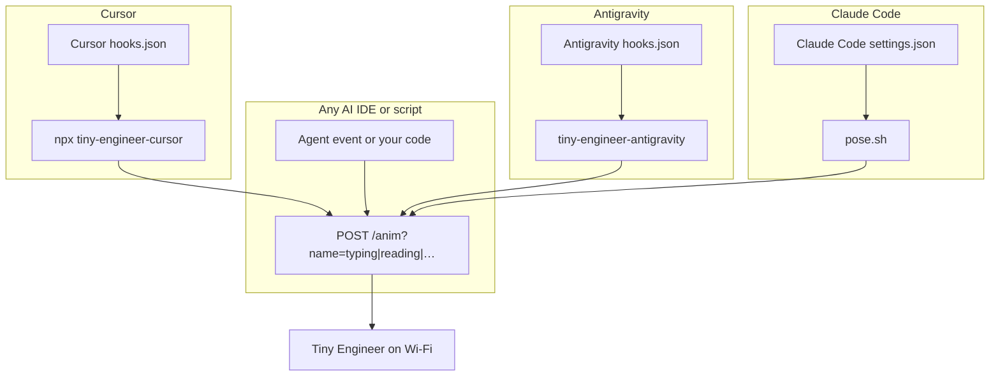

# Integrating Tiny Engineer

Tiny Engineer is a Wi-Fi desk robot. Drive it from any tool that can make HTTP requests, or use one of the dedicated helpers that map agent hook events to poses.

Robot must be on the same network. Base URL: `http://tiny-engineer.local` (or the IP shown on the OLED). Full HTTP reference: [`api.md`](api.md).

Four integration paths:

| Path | Best for | How |
|---|---|---|
| **REST API** | Any AI IDE, script, CI, custom agent | `POST /anim?name=…` |
| **Cursor CLI** | Cursor project hooks | `npx` → `tiny-engineer-cursor` |
| **Antigravity CLI** | Antigravity CLI lifecycle hooks | `tiny-engineer-antigravity` |
| **Claude Code hooks** | Claude Code project hooks | `.claude/hooks/pose.sh` |



---

## 1. REST API (any AI IDE)

Call the board directly. Works with Claude Code, Windsurf, Continue, custom plugins, shell hooks, or anything that can `POST` over HTTP.

### Main call

```bash
curl -X POST "http://tiny-engineer.local/anim?name=typing"
```

| `name` | Typical use |
|---|---|
| `typing` | Agent writing / editing / running tools |
| `reading` | Agent reading files / context |
| `thinking` | Agent reasoning / waiting on a long step |
| `ring` | Turn finished (attention ping) |
| `welcome` | Session start / greeting |
| `wakeup` | Sleep-inertia wake (eyes/head) |
| `sleep` | Force sleep (eye close + OLED off) |
| `attention` | Needs user input |
| `error` / `abort` | Failure / cancel |
| `dead` | Out of power (error line, then X X hold) |
| `none` | Idle / clear pose |

Firmware holds each pose ≥1s and keeps only the **latest** pending switch — spam-safe. Auth is optional: if you set an access token on the device, send `Authorization: Bearer <token>` (check `GET /auth` for `required`). Prefer short timeouts (e.g. 2s) and ignore network errors so the agent never stalls if the robot is offline.

### Minimal examples

**Shell**

```bash
curl -4 -sS -m 2 -X POST "http://tiny-engineer.local/anim?name=reading" >/dev/null || true
```

**JavaScript (Node 18+)**

```js
await fetch("http://tiny-engineer.local/anim?name=thinking", {
  method: "POST",
  signal: AbortSignal.timeout(2000),
}).catch(() => {});
```

**Python**

```python
import urllib.request
urllib.request.urlopen(
    urllib.request.Request(
        "http://tiny-engineer.local/anim?name=typing",
        method="POST",
    ),
    timeout=2,
)
```

Wire these into your IDE’s hook / plugin / lifecycle events (prompt submitted → `reading`, tool use → `typing`, turn end → `ring`, etc.). Mapping is yours; the robot only cares about `name`.

Health check (no motion):

```bash
curl http://tiny-engineer.local/health
```

More routes (tests, servo, web UI): [`api.md`](api.md).

---

## 2. Cursor dedicated script

For [Cursor](https://cursor.com/) only: a small Node CLI reads Cursor hook JSON on stdin, picks an animation, and POSTs `/anim`. No need to implement the event map yourself.

### Command

```bash
npx -y --package=https://github.com/jamro/tiny-engineer/archive/refs/heads/main.tar.gz tiny-engineer-cursor
```

- HTTPS **tarball** (not `github:…` SSH shorthand — that often fails in Cursor hooks with no SSH agent).
- Bin name `tiny-engineer-cursor` required after `--package=…`.
- Optional: `--url http://192.168.x.x` (default `http://tiny-engineer.local`).
- Auth: if the device has an `access_token`, set `TINY_ENGINEER_TOKEN` in the process env or a project-root `.env` file (same value). The CLI sends `Authorization: Bearer …`. No token → no header (auth disabled on device).
- `--help` for usage and event map.

### Smoke test

```bash
npx -y --package=https://github.com/jamro/tiny-engineer/archive/refs/heads/main.tar.gz tiny-engineer-cursor --help
echo '{"hook_event_name":"stop"}' | npx -y --package=https://github.com/jamro/tiny-engineer/archive/refs/heads/main.tar.gz tiny-engineer-cursor
```

### Wire into any Cursor project

In that project’s `.cursor/hooks.json`, use the same command for each anim hook. Set **`timeout` ≥ 30** (cold `npx` can exceed 2s). Full sample + event table: [`hooks.md`](hooks.md).

Inside this firmware repo you can instead run the local bin while developing the CLI:

```bash
node packages/tiny-engineer-cursor/bin/tiny-engineer-cursor.js
```

---

## 3. Antigravity CLI dedicated script

For [Google Antigravity](https://github.com/google/antigravity) (`antigravity-cli`): a lightweight Node CLI receives Antigravity lifecycle hook payloads on stdin, maps the agent lifecycle / tool calls to animations, and responds with the expected hook decision JSON while posting `/anim`.

### Event Mapping
- **`PreInvocation`** (Model thinking) → `thinking`
- **`PreToolUse`** (Reading tools: `view_file`, `grep_search`, `find_by_name`, `list_dir`, etc.) → `reading`
- **`PreToolUse`** (Writing tools: `write_to_file`, `replace_file_content`, `run_command`) → `typing`
- **`PostToolUse`** (Tool error) → `attention`
- **`Stop`** (`model_stop` / completion) → `ring` (rings the physical desk bell!)
- **`Stop`** (`error` / `aborted`) → `error` / `abort`

### Setup

Inside this firmware repository, [`.agents/hooks.json`](../.agents/hooks.json) is pre-configured. Run the local bin: `node packages/tiny-engineer-antigravity/bin/tiny-engineer-antigravity.js`. Other machines can `npx -y --package=https://github.com/jamro/tiny-engineer/archive/refs/heads/main.tar.gz tiny-engineer-antigravity` (same tarball pattern as Cursor).

To run globally across all projects on your machine, configure `~/.gemini/config/hooks.json`:

```json
{
  "tiny-engineer": {
    "PreInvocation": [
      {
        "command": "tiny-engineer-antigravity PreInvocation",
        "timeout": 3
      }
    ],
    "PreToolUse": [
      {
        "matcher": "*",
        "hooks": [
          {
            "command": "tiny-engineer-antigravity PreToolUse",
            "timeout": 3
          }
        ]
      }
    ],
    "PostToolUse": [
      {
        "matcher": "*",
        "hooks": [
          {
            "command": "tiny-engineer-antigravity PostToolUse",
            "timeout": 3
          }
        ]
      }
    ],
    "Stop": [
      {
        "command": "tiny-engineer-antigravity Stop",
        "timeout": 3
      }
    ]
  }
}
```

---

## 4. Claude Code hooks

For [Claude Code](https://claude.com/claude-code): a small bash script driven by [Claude Code's own hook system](https://docs.claude.com/en/docs/claude-code/hooks) — no Node dependency, no CLI to install. Claude Code hooks already carry an event name and, for `PreToolUse`, a `matcher` on the tool name, so the event-to-pose mapping is just static config in `settings.json` — the script itself has no logic to pick an animation, it's told exactly which one to play.

### Event Mapping

| Hook event | Matcher | Pose |
|---|---|---|
| `SessionStart` | — | `welcome` |
| `UserPromptSubmit` | — | `reading` |
| `PreToolUse` | `Read` / `Grep` / `Glob` | `reading` |
| `PreToolUse` | `Bash` / `Edit` / `Write` | `typing` |
| `PreCompact` | — | `thinking` |
| `Notification` | — | `attention` |
| `Stop` | — | `ring` (rings the physical desk bell!) |

### Setup

Inside this repo, [`.claude/settings.json`](../.claude/settings.json) and [`.claude/hooks/pose.sh`](../.claude/hooks/pose.sh) are pre-configured — open the repo in Claude Code and the hooks fire automatically. To use in any other project, copy both files into that project's `.claude/` directory.

- Override the robot's address with `TINY_ENGINEER_URL` (default `http://tiny-engineer.local`).
- Auth: if the device has an `access_token`, set `TINY_ENGINEER_TOKEN` in the environment. The script sends `Authorization: Bearer …`. No token → no header (auth disabled on device).
- Every call is detached and backgrounded with a short timeout, and the script always exits `0` — a hook must never stall or fail the agent session, robot online or not.
- Events are appended to `.claude/tiny-engineer-hooks.log` (gitignored) for local debugging.

Smoke test (robot should ring):

```bash
echo '{}' | bash .claude/hooks/pose.sh ring test
```

If a hook never fires, confirm Claude Code loaded the project's `.claude/settings.json` (check `/hooks` inside a session) and that `pose.sh` kept its executable bit — a checkout that strips it (e.g. Windows without `core.filemode`) needs `git update-index --chmod=+x .claude/hooks/pose.sh` once.

---

## Which to choose?

- **Building for one IDE / custom agent** → REST. One `POST`, zero Node dependency.
- **Using Cursor and want zero mapping code** → Cursor CLI + hooks.
- **Using Antigravity CLI** → Antigravity CLI + hooks.
- **Using Claude Code** → the bundled `pose.sh` + `settings.json`. No Node dependency either — it's the simplest of the four to read and modify.
- **All four** are fine together: every path is a thin client of the same `/anim` API.

Prerequisites for any path: flash firmware, join 2.4 GHz Wi-Fi, confirm `http://tiny-engineer.local/health` (or the OLED IP) responds.

---

## Optional extras

Same `POST /anim` API; not part of the three paths above. On macOS you can run a small host helper that POSTs `sleep` / `wakeup` when the screen locks or unlocks: [`macos-lock-unlock.md`](macos-lock-unlock.md). The robot does not need it.
