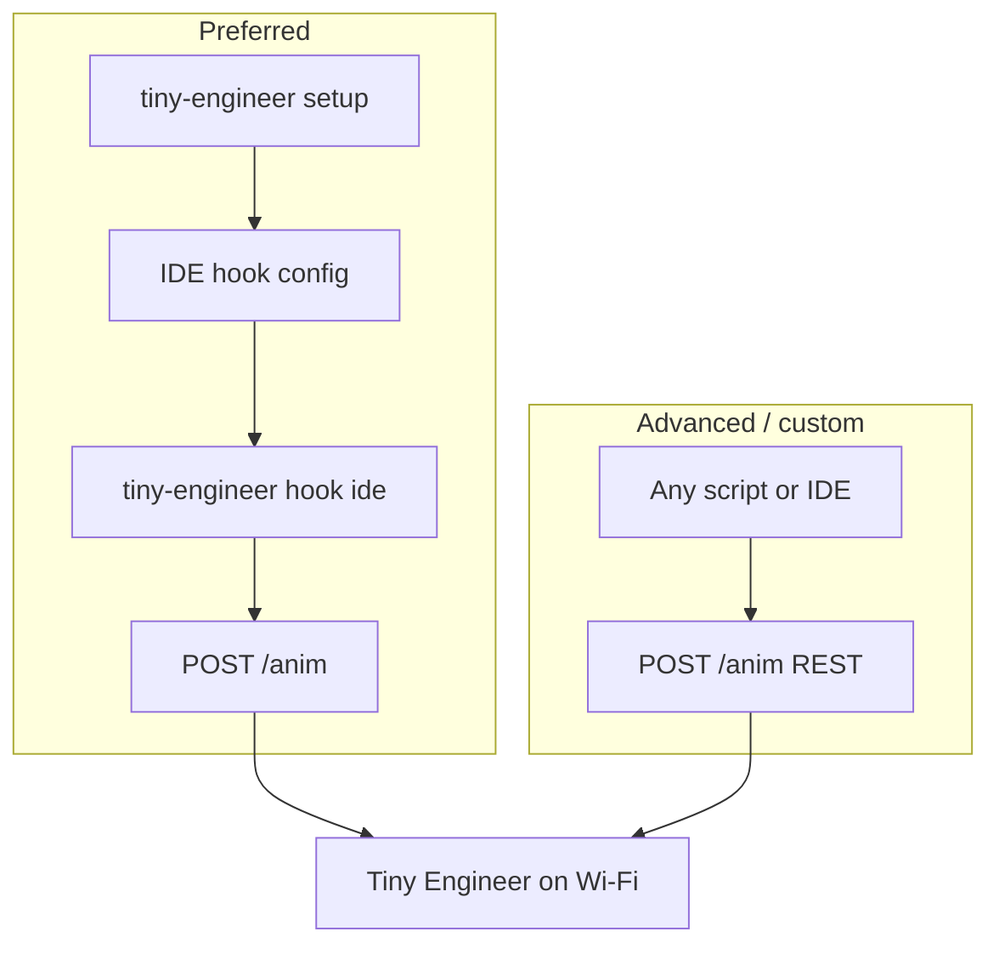

# Integrating Tiny Engineer

Tiny Engineer is a Wi-Fi desk robot. Prefer the unified **`tiny-engineer` CLI** for Cursor, Claude Code, and Antigravity hooks. For custom agents, other IDEs, or scripts, call the **REST API** directly.

Robot must be on the same network. Base URL: `http://tiny-engineer.local` (or the IP shown on the OLED). Full HTTP reference: [`api.md`](api.md).

| Path | Best for | How |
|---|---|---|
| **`tiny-engineer` CLI** (default) | Cursor, Claude Code, Antigravity hooks | `tiny-engineer setup` → `hook <ide>` → `POST /anim` |
| **REST API** (advanced) | Custom agents, other IDEs, CI, one-off scripts | `POST /anim?name=…` ([`api.md`](api.md)) |


```mermaid
flowchart TB
  subgraph preferred [Preferred]
    Setup["tiny-engineer setup"]
    Setup --> Hooks[IDE hook config]
    Hooks --> Cli["tiny-engineer hook ide"]
    Cli --> Anim["POST /anim"]
  end
  subgraph advanced [Advanced / custom]
    Script[Any script or IDE] --> Rest["POST /anim REST"]
  end
  Anim --> Robot[Tiny Engineer on Wi-Fi]
  Rest --> Robot
```

Prerequisites: flash firmware, join 2.4 GHz Wi-Fi, confirm `http://tiny-engineer.local/health` (or the OLED IP) responds.

---

## 1. Unified CLI (default)

Package: [`packages/tiny-engineer-cli`](../packages/tiny-engineer-cli/). Bin name: **`tiny-engineer`**.

Maps IDE hook events to poses and POSTs `/anim`. Also installs/uninstalls hook entries, checks wiring (`doctor`), and can `anim` / `play` without writing your own HTTP client.

### Install / run

**This firmware repo (local):**

```bash
node packages/tiny-engineer-cli/bin/tiny-engineer.js --help
node packages/tiny-engineer-cli/bin/tiny-engineer.js setup
node packages/tiny-engineer-cli/bin/tiny-engineer.js doctor
```

**Any project (HTTPS tarball — not `github:…` SSH):**

```bash
npx -y --package=https://github.com/jamro/tiny-engineer/archive/refs/heads/main.tar.gz tiny-engineer --help
npx -y --package=https://github.com/jamro/tiny-engineer/archive/refs/heads/main.tar.gz tiny-engineer setup cursor --yes
```

- HTTPS **tarball** (not `github:…` — that often fails in IDE hooks with no SSH agent).
- Bin name `tiny-engineer` required after `--package=…`.
- Cold `npx` can be slow: use hook **`timeout` ≥ 30** when the command is `npx …`.
- Optional: `--url http://192.168.x.x` (default `TINY_ENGINEER_URL`, else `http://tiny-engineer.local`).
- Auth: if the device has an `access_token`, set `TINY_ENGINEER_TOKEN` in the process env or a project-root `.env`. The CLI sends `Authorization: Bearer …`.

### Setup wizard

```bash
tiny-engineer setup                  # interactive: pick IDEs
tiny-engineer setup cursor --yes
tiny-engineer setup --all --yes --url http://192.168.1.10
tiny-engineer doctor
tiny-engineer uninstall cursor --yes # remove only Tiny Engineer hook entries
```

`setup` merges hook commands into the project (Cursor `.cursor/hooks.json`, Claude Code `.claude/settings.json`, Antigravity `.agents/hooks.json`) and can write `TINY_ENGINEER_URL` into `.env`. It does not delete foreign hooks.

This firmware repo already ships those configs pointing at the local CLI bin.

### Hook smoke test

```bash
echo '{"hook_event_name":"stop"}' | node packages/tiny-engineer-cli/bin/tiny-engineer.js hook cursor
```

Cursor deep dive (event table, sample `hooks.json`): [`hooks.md`](hooks.md).

### Manual anim / play

```bash
tiny-engineer anim ring
tiny-engineer play /tmp/clip.wav
tiny-engineer play /tmp/clip.wav --name thinking
```

WAV for `/play`: 16-bit mono PCM at 22050 Hz. Details: [`api.md#post-play`](api.md#post-play).

### Speaking through the robot (skill)

Install the shared [`tiny-engineer-play`](../skills/tiny-engineer-play/SKILL.md) skill (`curl` + `POST /play`). Same skill works in Claude Code, Cursor, and Antigravity:

```bash
mkdir -p ~/.claude/skills && ln -s "$PWD/skills/tiny-engineer-play" ~/.claude/skills/                         # Claude Code
mkdir -p ~/.cursor/skills && ln -s "$PWD/skills/tiny-engineer-play" ~/.cursor/skills/                         # Cursor
mkdir -p ~/.gemini/antigravity/skills && ln -s "$PWD/skills/tiny-engineer-play" ~/.gemini/antigravity/skills/  # Antigravity
```

---

## 2. REST API (advanced / custom)

Call the board directly when you are not using the supported IDE hooks, or when you need full control of mapping and timing. Works with any AI IDE, CI, shell hooks, or plugin that can `POST` over HTTP.

### Main call

```bash
curl -X POST "http://tiny-engineer.local/anim?name=typing"
```

| `name` | Typical use |
|---|---|
| `typing` | Agent writing / editing / running tools |
| `reading` | Agent reading files / context |
| `thinking` | Agent reasoning / waiting on a long step |
| `ring` | Turn finished (attention ping) |
| `welcome` | Session start / greeting |
| `wakeup` | Sleep-inertia wake (eyes/head) |
| `sleep` | Force sleep (eye close + OLED off) |
| `attention` | Needs user input |
| `error` / `abort` | Failure / cancel |
| `dead` | Out of power (`dead.wav`, then X X hold) |
| `none` | Idle / clear pose |

Firmware holds each pose ≥1s and keeps only the **latest** pending switch — spam-safe. Auth is optional: if you set an access token on the device, send `Authorization: Bearer <token>` (check `GET /auth` for `required`). Prefer short timeouts (e.g. 2s) and ignore network errors so the agent never stalls if the robot is offline.

### Minimal examples

**Shell**

```bash
curl -4 -sS -m 2 -X POST "http://tiny-engineer.local/anim?name=reading" >/dev/null || true
```

**JavaScript (Node 18+)**

```js
await fetch("http://tiny-engineer.local/anim?name=thinking", {
  method: "POST",
  signal: AbortSignal.timeout(2000),
}).catch(() => {});
```

**Python**

```python
import urllib.request
urllib.request.urlopen(
    urllib.request.Request(
        "http://tiny-engineer.local/anim?name=typing",
        method="POST",
    ),
    timeout=2,
)
```

Wire these into your IDE’s hook / plugin / lifecycle events (prompt submitted → `reading`, tool use → `typing`, turn end → `ring`, etc.). Mapping is yours; the robot only cares about `name`.

Health check (no motion):

```bash
curl http://tiny-engineer.local/health
```

Full route list (tests, servo, web UI, `/play`): [`api.md`](api.md).

---

## Which to choose?

- **Cursor / Claude Code / Antigravity** → unified CLI (`tiny-engineer setup`).
- **Custom agent, other IDE, CI, or no Node** → REST (`POST /anim`).
- Both paths hit the same firmware API; the CLI is a thin client.

---

## Deprecated: per-IDE packages

These packages still work but are **deprecated**. Prefer `tiny-engineer` (above). Migrate with `tiny-engineer setup`, then remove old entries (`tiny-engineer uninstall` strips Tiny Engineer commands by marker).

| Package | Bin | Notes |
|---|---|---|
| [`packages/tiny-engineer-cursor`](../packages/tiny-engineer-cursor/) | `tiny-engineer-cursor` | Superseded by `tiny-engineer hook cursor` |
| [`packages/tiny-engineer-antigravity`](../packages/tiny-engineer-antigravity/) | `tiny-engineer-antigravity` | Superseded by `tiny-engineer hook antigravity` |
| [`packages/tiny-engineer-claude-code`](../packages/tiny-engineer-claude-code/) | `tiny-engineer-claude-code` | Superseded by `tiny-engineer hook claude-code` |

For custom mapping beyond the unified CLI, use the [REST API](#2-rest-api-advanced--custom) instead of forking the old packages.

---

## Optional extras

Same `POST /anim` API. On macOS you can run a small host helper that POSTs `sleep` / `wakeup` when the screen locks or unlocks: [`macos-lock-unlock.md`](macos-lock-unlock.md). The robot does not need it.
