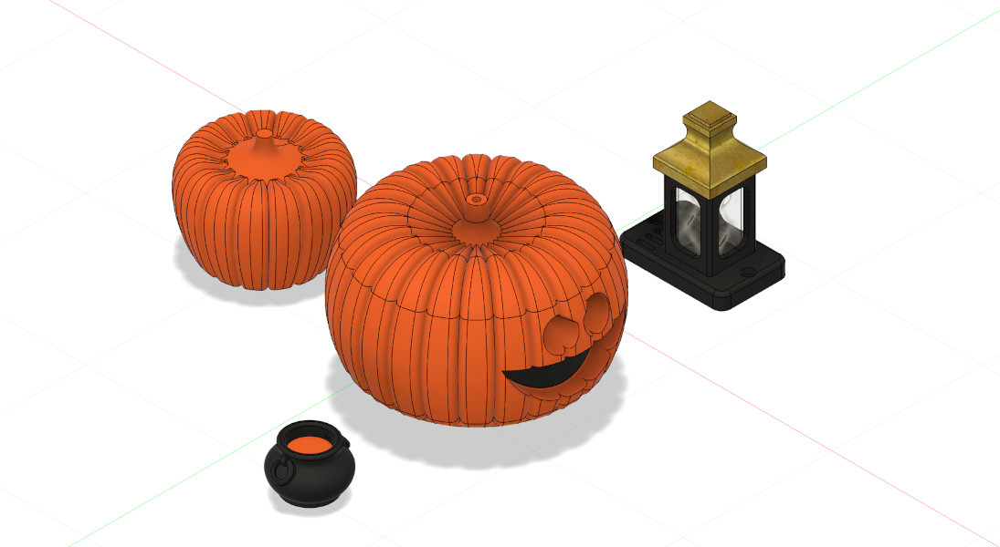

# Halloween

Optional Halloween mod for Tiny Engineer. [`3d_models/`](3d_models/) holds alternate versions of the **head**, **lamp**, and **mug**, plus a **standalone pumpkin** you can print in any amount and place next to the desk. Printables and Fusion source live under `3d_models/parts/{servo_id}/` (same servo folders as stock).

## Parts

| Role | Files |
| --- | --- |
| Head | `Head`, `PumpkinTop`, `PumpkinCover` |
| Lamp | `LampBase`, `LampDiffuser`, `LampCap` |
| Mug | `Pot`, `Mixture` (replaces stock `Mug` / `Coffee`) |
| Standalone | `Pumpkin` (decorative; not mounted on the robot) |

## Head assembly

The head is three parts. `Head` is the servo holder — mount it like the stock head component first and have it on the robot before you continue. Shared mechanical steps (servo, neck join): [docs/3d/assembly.md](../../docs/3d/assembly.md) (§1 Head, §4 Join Neck and Head).

1. Mount `Head` on the robot (servo in the holder) the same way as the regular `Head`. Finish this before the pumpkin shell.
2. Screw `PumpkinTop` into `PumpkinCover`.
3. Seat the OLED in `PumpkinCover`, then slide the cover onto the `Head` already on the robot.
4. Route the servo and OLED cords through the two side slots on the back of the head.
5. Optionally fasten the cover to `Head` with an M2 screw — there is a mount hole on the back.

## Lamp and mug

Mount the lamp and mug the same way as the stock parts. Lamp: [assembly §13](../../docs/3d/assembly.md#13-esp32-powerap-smoke-test-and-lampbase) (`LampBase`) and [§19](../../docs/3d/assembly.md#19-lamp-press-fit) (`LampCap` / `LampDiffuser`). Mug: [assembly §14](../../docs/3d/assembly.md#14-desk-props--laptop-mug-bell) — use `Pot` and `Mixture` in place of `Mug` and `Coffee`.

## Standalone pumpkin

Print `Pumpkin` as a desk prop. Scale it freely, or print several in different sizes, and place them next to the desk.

## Audio

Alternate speaker clips are in [`assets/`](assets/). The set replaces `welcome`, `attention`, `error`, and `abort`. `bell` and `dead` stay the stock files. Transcripts and cue marks are in [`assets/README.md`](assets/README.md).

Build and flash this overlay with `custom_audio_mod = halloween` in [`platformio.ini`](../../platformio.ini), then `pio run -t upload`. See [docs/flash.md](../../docs/flash.md).
